<div align="center">

# Enterprise CRM Intelligence & Customer 360 Platform

**Production-grade Customer Master Data Management (MDM), predictive analytics, and an operational CRM Action Engine — built on a medallion lakehouse architecture and modelled after enterprise ERP-CRM patterns (SAP CRM · Odoo CRM · Dynamics 365).**

[](https://www.microsoft.com/sql-server)
[](https://python.org)
[](https://xgboost.readthedocs.io)
[](https://lifelines.readthedocs.io)
[](https://powerbi.microsoft.com)
[](https://scikit-learn.org)
[](https://github.com/rafjaa/LeIA)
[](LICENSE)
[]()

**Lead Developer:** Abdallah A Khames &nbsp;·&nbsp; **Organisation:** [BODZZ](https://github.com/abdallah-bodzz) &nbsp;·&nbsp; **Version:** 1.0 &nbsp;·&nbsp; **Date:** June 2026

</div>

---

## What this is

An end-to-end **Enterprise CRM Intelligence Platform** — designed and delivered as a solo project. Not "I trained a model and made a chart."

This is the full stack: a **Medallion Lakehouse** (Bronze → Silver → Gold) on SQL Server with proper **Customer Master Data Management (MDM)** via SCD Type 2, five predictive ML models running through a subprocess-isolated Python orchestrator, an operational **CRM Action Engine** that writes prioritised retention and reactivation tasks back into the database, and a seven-page stakeholder-facing Power BI report with drill-through, What-If simulation, and a custom theme suite built from scratch.

The architecture follows the customer entity and action queue patterns of enterprise ERP-CRM systems — specifically the customer master and campaign automation design you'd find in **SAP CRM**, **Odoo CRM**, and **Dynamics 365 Customer Insights**. The difference is that every layer here is transparent, documented, and reproducible from source SQL through to the BI layer.

The dataset is [Olist's Brazilian E-Commerce Public Dataset](https://www.kaggle.com/datasets/olistbr/brazilian-ecommerce) — 100K orders, 1.55M rows across 9 source tables, R$15.84M GMV. The data problems are real: 96.88% one-time buyers, 71.18% structural churn baseline, fragmented customer identities (Olist issues a fresh `customer_id` per order), and review coverage so skewed toward dissatisfied customers that a naive VADER run would silently produce junk on Portuguese text. Every one of those problems is solved at the right layer.

Everything here — the SQL, the Python, the notebooks, the phase documentation, the Power BI themes — was written from scratch. No templates, no copy-paste notebooks, no generic aesthetics.

---

## At a glance

> Designed and delivered a production-grade **Enterprise CRM Intelligence Platform** on a medallion lakehouse architecture. Implemented **Customer Master Data Management (MDM)** with SCD Type 2, five predictive ML models (Churn, CLV, Next-Purchase Timing, RFM Segmentation, PT-BR Sentiment), and an operational **CRM Action Engine** that translates ML predictions into prioritised retention and reactivation tasks — modelled after SAP CRM and Odoo customer entity structures. Delivered across 96,096 unified customers and R$15.84M GMV with stakeholder-facing Power BI dashboards covering executive, retention, territory, and CX audiences.

### Key metrics

| What | Value |
|------|-------|
| Source tables ingested | 9 CSV files · 1.55M rows |
| Customers unified (post-MDM dedup) | **96,096** |
| Total GMV modelled | **R$15.84M** |
| ML models in production | **5** (sentiment · segmentation · CLV · churn · next-purchase) |
| HIGH-priority retention flags | **11,957 customers** |
| Total actionable CRM queue | **38,531 customers (40.1%)** |
| Champions segment churn rate | **0%** |
| Churn model ROC-AUC / F1 / Recall | **0.7995 / 0.8499 / 0.9469** |
| Power BI pages | **7** (+ tooltip + drill-through) |
| DAX measures | **29** |
| Bookmarks | **14** |
| SQL scripts | **20+** |
| Python scripts | **10** |
| Development notebooks | **6** |
| Phase documentation | **6 signed-off phase reports** |
| Saved ML model artifacts | **7** |
| Figures generated | **50+** |

---

## Solution architecture

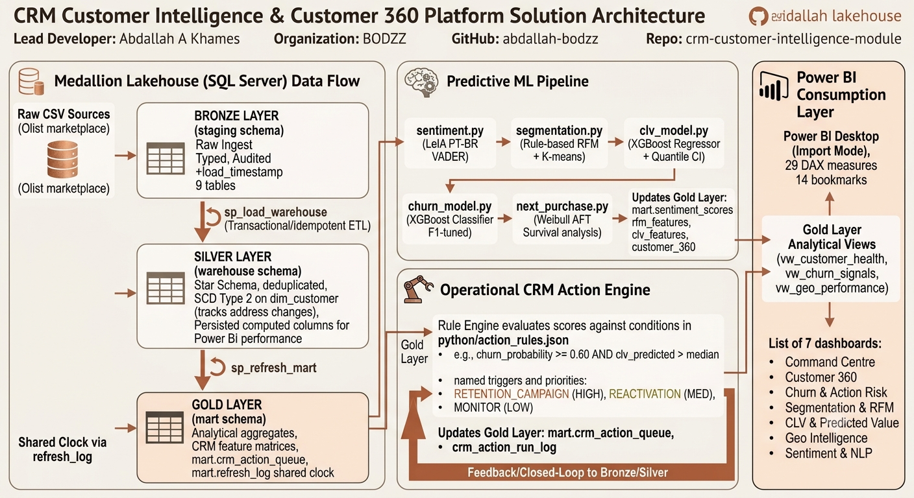

*Figure 1 — High-Level Solution Architecture: Medallion lakehouse ingestion through ML pipeline to stakeholder BI layer*

The platform is structured as three independently versioned layers connected by idempotent ETL procedures, with Python ML sitting above the Gold layer and Power BI consuming analytical views — never mart tables directly.

```
9 CSV files (Olist · 1.55M rows)
        │
        ▼  ingest_bronze.py
┌──────────────────────────────────────┐
│  BRONZE  ·  staging schema           │
│  Raw · typed · audited               │
│  +load_timestamp  +source_file       │
└──────────────────┬───────────────────┘
                   │  sp_load_warehouse
                   ▼
┌──────────────────────────────────────┐
│  SILVER  ·  warehouse schema         │
│  SCD Type 2  dim_customer (MDM)      │
│  Star schema · FK constraints        │
│  Persisted computed columns          │
│  Point-in-time transactional joins   │
└──────────────────┬───────────────────┘
                   │  sp_refresh_mart
                   ▼
┌──────────────────────────────────────┐
│  GOLD  ·  mart schema                │
│  customer_360  ·  rfm_features       │
│  clv_features  ·  sentiment_scores   │
│  crm_action_queue  ·  refresh_log    │
│  vw_customer_health                  │
│  vw_churn_signals                    │
│  vw_geo_performance                  │
└──────────────────┬───────────────────┘
                   │  run.py (subprocess-isolated)
                   ▼
┌──────────────────────────────────────┐
│  Python ML Pipeline                  │
│  sentiment → segmentation →          │
│  clv → churn → next_purchase →       │
│  action_rules                        │
└──────────────────┬───────────────────┘
                   │  Power BI Import (via views)
                   ▼
┌──────────────────────────────────────┐
│  7 Power BI Dashboard Pages          │
│  Command Centre · Customer 360       │
│  Churn Risk · Segmentation · CLV     │
│  Geo Intelligence · Sentiment & NLP  │
└──────────────────────────────────────┘
```

The architecture mirrors the customer entity structure of **SAP CRM** and **Odoo CRM** — Customer MDM with SCD2 history tracking, point-in-time transactional joins, and an operational CRM Action Engine that converts ML predictions into executable business tasks, not just charts. This is the pattern enterprise ERP-CRM consulting teams implement at scale; this project implements it transparently from source SQL through to the BI layer.

---

## End-to-end data flow

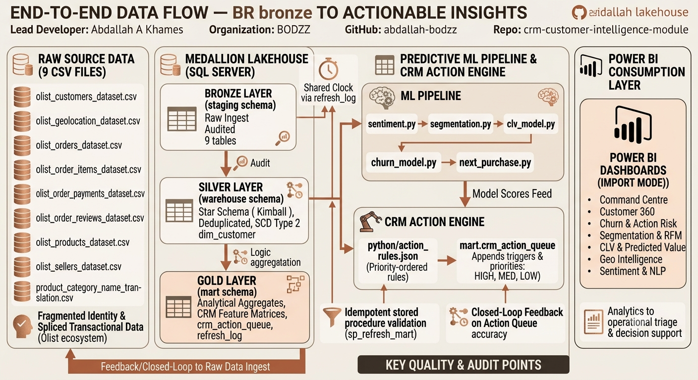

*Figure 2 — End-to-End Data Flow: from raw CSV ingest through medallion layers to ML predictions and CRM action records*

---

## Capabilities delivered

| Domain | What's implemented |
|--------|--------------------|
| **Customer Master Data Management (MDM)** | SCD Type 2 on `customer_unique_id` · database-enforced current-row integrity via filtered unique index · point-in-time historical joins · deterministic duplicate resolution |
| **Enterprise Data Architecture** | Medallion Lakehouse (Bronze → Silver → Gold) on SQL Server · star schema with FK constraints · persisted computed columns · idempotent transactional ETL procedures |
| **Customer 360° View** | `mart.customer_360` — unified account record aggregating orders, GMV, freight, delivery performance, review scores, PT-BR sentiment, health score, churn probability, CLV, and next-purchase estimate |
| **Predictive CRM Analytics** | Churn classifier (XGBoost, F1-tuned, ROC-AUC 0.7995) · CLV with 80% quantile confidence intervals · Next-Purchase Timing via Weibull AFT survival analysis |
| **RFM Segmentation & Clustering** | 9-segment rule-based engine (exhaustiveness-verified across all 125 score combinations) · K-means (K=7) for data-driven exploratory clustering |
| **Sentiment Analysis — PT-BR** | LeIA (Portuguese VADER) · 40,641 reviews scored · population-median imputation for coverage gaps |
| **Operational CRM Action Engine** | JSON-driven rule engine · `RETENTION_CAMPAIGN / REACTIVATION / MONITOR` records · human-readable `trigger_reason` per customer · CLI threshold overrides · full audit log |
| **Revenue Operations (RevOps)** | 11,957 HIGH-priority retention candidates · projected ~R$2.72M 6-month revenue uplift · GMV concentration and Pareto analysis |
| **Stakeholder BI Platform** | 7-page Power BI report · 29 DAX measures · What-If threshold simulation · Customer 360 drill-through · geo intelligence for territory management |
| **Data Quality & Governance** | Post-pipeline ML DQ report (HTML) · Silver + Gold verification scripts · `mart.refresh_log` shared clock · audit columns throughout |

---

## Customer MDM — SCD Type 2

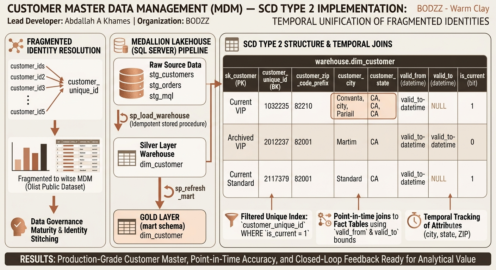

*Figure 3 — Customer MDM & SCD Type 2: business key resolution, version history, and filtered unique index enforcement*

Olist issues a fresh `customer_id` per order. A naive `COUNT(DISTINCT customer_id)` returns 99,441. The correct number is **96,096** — a 3.36% overcount from 2,997 customers with multiple IDs (up to 17 per individual). SCD Type 2 on `customer_unique_id` resolves this. A filtered unique index enforces exactly one current row per business key at the schema level — uniqueness lives in the database constraint, not in ETL discipline.

---

## Project structure

```
crm-customer-intelligence-module/
│
├── sql/
│   ├── 00_setup/               # Database + staging schema DDL
│   ├── 02_warehouse/           # Silver layer: 5 dims + 2 facts + ETL proc + verify
│   ├── 03_mart/                # Gold layer: 6 tables + ETL proc + migrations + verify
│   └── 04_views/               # 3 analytical views (Power BI data source)
│
├── python/
│   ├── run.py                  # Orchestrator — subprocess-isolated pipeline
│   ├── ingest_bronze.py        # CSV → staging (chunked, audited, retry-with-backoff)
│   ├── sentiment.py            # LeIA PT-BR sentiment scoring
│   ├── segmentation.py         # RFM rule engine + K-means (exhaustiveness-verified)
│   ├── clv_model.py            # XGBoost CLV + quantile CI (leakage-corrected)
│   ├── churn_model.py          # XGBoost churn (F1-tuned threshold, leakage-corrected)
│   ├── next_purchase.py        # Weibull AFT survival analysis
│   ├── action_rules.py         # JSON-driven CRM action queue rule engine
│   ├── dq_report.py            # Post-pipeline ML quality report → HTML
│   ├── utils.py                # Shared: logging, engine, batched update, retry
│   ├── text_cleaning.py        # Lexicon-safe Portuguese text pre-processing
│   ├── config.py               # DB connection config (dotenv)
│   └── action_rules.json       # Rule thresholds and evaluation order
│
├── notebooks/                  # 6 development notebooks (EDA → RFM → CLV → Churn → Geo → Actions)
├── powerbi/                    # .pbix · .pdf · screenshots · themes · build guide
├── reports/                    # JSON dev summaries · dq_report.html · 50+ figures
├── docs/
│   ├── diagrams/               # 7 architecture diagrams
│   ├── data_dictionary.md      # Full column reference — all 13 tables + 3 views
│   ├── 02-eda-bronze-validation.md
│   ├── 03-silver-layer-warehouse.md
│   ├── 04-gold-layer-mart.md
│   ├── 05-ml-pipeline.md
│   └── 06-power-bi-dashboards.md
└── case_study/
    └── business_case.md        # Full technical + business writeup
```

---

## Pipeline walkthrough

### Bronze — Raw ingest

`ingest_bronze.py` loads all 9 CSV files into `staging` with zero transforms. Every table gets `load_timestamp` and `source_file` audit columns. Chunk sizing is derived from column count to stay under SQL Server's 2,100-parameter limit. Transient failures get exponential-backoff retry. The layer is immutable — it's the audit trail, not the compute surface.

### Silver — Customer MDM & warehouse build

`sp_load_warehouse` builds the star schema. The non-trivial parts:

**SCD Type 2 on `dim_customer`** — business key is `customer_unique_id`. Each version tracks city/state/zip changes with `valid_from`, `valid_to`, `is_current`. A filtered unique index enforces exactly one current row per customer at the schema level.

**Point-in-time SCD2 join** — `fact_orders` links to `dim_customer` via a priority-ranked `CROSS APPLY`. On fresh loads where all `valid_from` dates are set to today (after every historical order date), a fallback to the earliest known version prevents the first run from producing zero fact rows. Most tutorials skip this pattern entirely.

**Review deduplication** — Olist has duplicate `review_id` values across multiple `order_id` values. Silver deduplicates with `ROW_NUMBER()` on latest `review_creation_date` + `order_id ASC` for full determinism.

**`TRUNCATE` blocked by FKs** — SQL Server won't truncate a FK-targeted table, even when both referencing and referenced tables are being rebuilt. `dim_product` and `dim_seller` use `DELETE`; fact tables use `TRUNCATE`.

### Gold — CRM mart

`sp_refresh_mart` is fully transactional and idempotent. All mart tables truncate and rebuild every run. No FK dependencies on Silver — the mart is fully disposable by design.

Canonical constants declared once in the procedure, written to `mart.refresh_log`, read by every view:
- `@as_of_date` = `MAX(order_purchase_timestamp)` — computed fresh, never hardcoded
- `@ml_cutoff_date` = `'2018-05-01'` — EDA-locked
- `@churn_window_days` = `180` — EDA-locked

Health score:
```sql
health_score = (recency_pct * 0.4) + (monetary_pct * 0.4) + (satisfaction_pct * 0.2)
```
All three inputs use `PERCENT_RANK()` percentiles — immune to whale-customer distortion. The top 20% of customers drive 56.8% of GMV; linear max-scaling collapses everyone else. Customers with no reviews receive population-median imputation, not 0.

### Gold Layer Mart — ERD

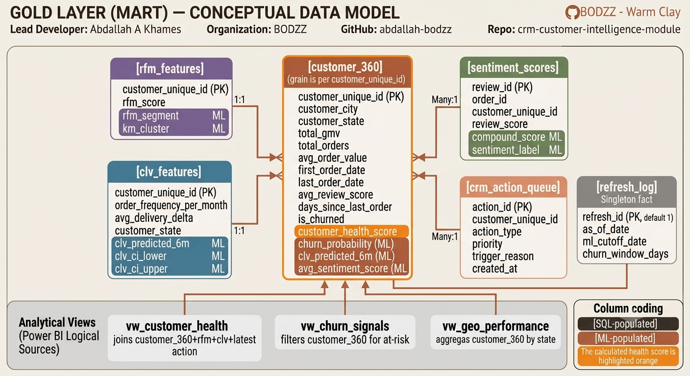

*Figure 4 — Gold Layer Mart ERD: table relationships, grain definitions, and Python-populated columns*

### Python ML pipeline

`run.py` runs each script as an isolated subprocess — not by importing modules in-process. Each script has its own argparse parser and calls `sys.exit()` on failure paths; in-process importing causes parser collisions and kills the whole pipeline on a single step's exit. Subprocess isolation matches how real production pipeline runners compose independently-developed scripts.

Execution order follows the dependency chain:
```
sentiment.py → segmentation.py → clv_model.py → churn_model.py → next_purchase.py → action_rules.py
```

All scripts support `--dry-run`. Shared infrastructure (logging, engine creation, batched updates, retry-with-backoff, `refresh_log` reads) lives in `utils.py`.

---

## ML models

### 1. Sentiment — LeIA (Portuguese VADER)

VADER's English-only lexicon silently scores Portuguese text as near-neutral — it doesn't flag unrecognised words, it just returns ~0.0. Feeding Olist's Brazilian Portuguese reviews through VADER produces a compound score distribution concentrated around 0 with no real signal. **LeIA** is a purpose-built Portuguese rebuild of VADER with a validated Brazilian Portuguese lexicon and emoji support.

Coverage is intentionally below 100%: `sentiment.py` only scores non-empty review text (41.29% coverage). Empty reviews receive population-median imputation downstream — conflating "no feedback" with "neutral feedback" at the row level would corrupt the per-review table.

| Metric | Value |
|--------|-------|
| Reviews scored | 40,641 |
| Positive | 51.93% |
| Neutral | 33.00% |
| Negative | 15.07% |
| Mean compound | 0.2048 |

### 2. RFM Segmentation — Rule-based + K-means

The rule set was verified exhaustive by brute-force enumeration of all 125 possible `(recency_score, frequency_score, monetary_score)` combinations before going into production. The original 5-segment plan left 61.6% of combinations unmatched — a real structural gap, not an edge case. Four additional segments were added because the gaps clustered into distinct, nameable patterns.

K-means (K=7, silhouette = 0.3106) runs independently as a second, data-driven layer. Initial silhouette computation took 854 seconds against 96k rows. Fixed with `sample_size=8000` — runtime dropped to ~20 seconds.

| Segment | Count | Churn Rate |
|---------|-------|------------|
| Frequent Low-Spender | 22,481 | 64.0% |
| Needs Attention | 14,167 | 100% |
| Loyal | 12,841 | 35.3% |
| Hibernating | 12,584 | 100% |
| Potential Loyalist | 10,572 | 27.3% |
| At Risk | 10,423 | 100% |
| Can't Lose | 8,846 | 100% |
| **Champions** | **3,807** | **0%** |
| Lost | 375 | 100% |

### 3. CLV — XGBoost + Quantile Regression CI

Features are recomputed from warehouse tables with `order_purchase_timestamp < '2018-05-01'` — not from `mart.clv_features` directly, which would leak post-cutoff transaction data into pre-cutoff training features. This is standard practice in real CLV modeling (BG/NBD, Pareto/NBD, any supervised approach) and it was a real leakage risk in the original implementation.

Point estimate uses XGBoost `objective='reg:squarederror'`. Confidence interval uses two additional XGBoost models at `quantile_alpha=0.1` and `0.9`. Interval integrity is enforced — lower and upper models are independent fits that can occasionally cross; predictions are clamped before writing.

R² is −0.05 on a 99.21% zero-inflated target. Expected, not broken. MAE of R$2.47 is the relevant metric. Operationally, the model's value is in rank-ordering customers by repurchase likelihood, not in absolute R$ point predictions.

### 4. Churn — XGBoost (F1-tuned threshold)

`is_churned = no order within 180 days of last purchase`. With a 71% positive class, a 0.5 threshold is not safe — it's uninformative. Threshold tuned by maximising F1 on a holdout set.

A target leakage bug was caught during development: `days_since_last_order` was originally in the feature set. Since `is_churned = (days_since_last_order > 180)`, the model learned the label definition — F1=1.0, feature importance = 1.0 on that one column, 0.0 on everything else. Removed. Corrected model: F1=0.8499, AUC=0.7995.

| Metric | Value |
|--------|-------|
| Tuned threshold | 0.2990 |
| F1-score | 0.8499 |
| Precision | 0.7708 |
| Recall | 0.9469 |
| ROC-AUC | 0.7995 |

### 5. Next-Purchase Timing — Weibull AFT Survival Analysis

Training grain is one row per inter-purchase interval, not one row per customer. A customer with N orders contributes (N−1) observed intervals plus one right-censored interval (last order → `as_of_date`). Collapsing to a per-customer average throws away the censoring information — the entire reason survival analysis exists.

`predict_median(..., conditional_after=days_since_last_order)` computes E[T | T > s] — expected remaining time conditioned on the customer having already waited s days. Naively subtracting `days_since_last_order` from the full expected interval distorts estimates for overdue customers.

Scope: ≥2-order customers only (2,996 customers, 3.12% of base). This is the pattern used in Salesforce Einstein and Adobe Campaign for next-best-action timing, and it's rarely seen in portfolio projects.

### 6. CRM Action Engine — JSON Rule Engine

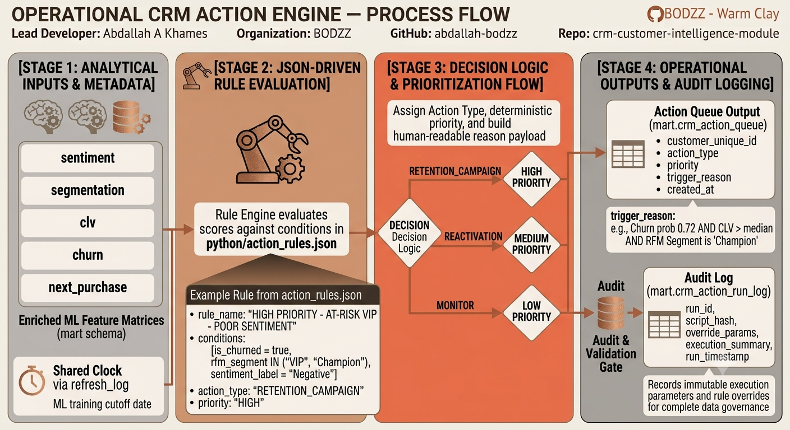

*Figure 5 — CRM Action Engine: ML prediction → rule evaluation → prioritised action record with human-readable trigger reason*

Rules are defined in `action_rules.json` and validated at startup against the database's `CHECK` constraint before any record is touched. Unknown action types, missing keys, and `MONITOR` not being last in `evaluation_order` all fail loudly — no silent partial-writes.

| Action | Priority | Condition |
|--------|----------|-----------|
| `RETENTION_CAMPAIGN` | HIGH | churn ≥ 0.60 AND CLV > median |
| `REACTIVATION` | MED | churn ≥ 0.60 AND CLV ≤ median |
| `MONITOR` | LOW | catch-all |

Every record includes a human-readable `trigger_reason` — e.g., *"Churn risk 0.837 ≥ 0.60; CLV R$0.96 at 55th pct — high-value customer, premium retention warranted."* This is the pattern SAP CRM and Salesforce use for campaign automation triggers; here it's fully transparent and auditable. Each run appends to `mart.action_run_log` with threshold history, count breakdowns, and a config snapshot.

**Action distribution:**

| Action | Priority | Count | % of Base |
|--------|----------|-------|-----------|
| `RETENTION_CAMPAIGN` | HIGH | 11,957 | 12.4% |
| `REACTIVATION` | MED | 26,574 | 27.7% |
| `MONITOR` | LOW | 57,565 | 59.9% |

---

## Power BI dashboards

Seven pages built on imported Gold views. All DAX measures live in a dedicated `_Measures` table. No calculated columns where SQL can do the work.

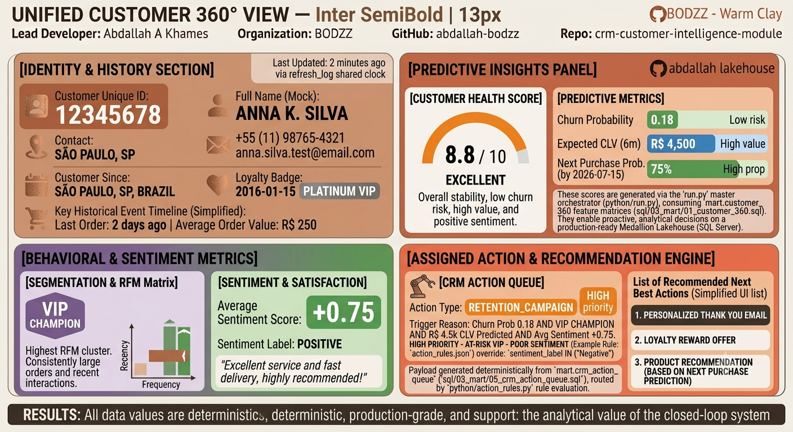

*Figure 6 — Customer 360° Conceptual View: the unified account record surfaced in the drill-through dashboard page*

| Page | Audience | Purpose |
|------|----------|---------|
| **Command Centre** | CEO / Head of Retention | Portfolio KPIs · action distribution · GMV trend · health tier · top states |
| **Customer 360** | Customer Success | Single-customer drill-through · full order history · delivery profile · sentiment strip · trigger reason |
| **Churn & Action Risk** | Retention Manager | Daily triage · ranked customer table · churn driver breakdown · What-If threshold simulator |
| **Segmentation & RFM** | CRM Analyst | Segment strategy · RFM scatter · segment-action heatmap · K-means toggle |
| **CLV & Predicted Value** | Revenue Forecasting | CLV histogram · CI band · actual vs predicted scatter · value quadrant |
| **Geo Intelligence** | Territory Manager | Brazil filled map · state rankings · delivery vs satisfaction |
| **Sentiment & NLP** | CX Analyst | Compound score distribution · sentiment trend · sarcasm detection |

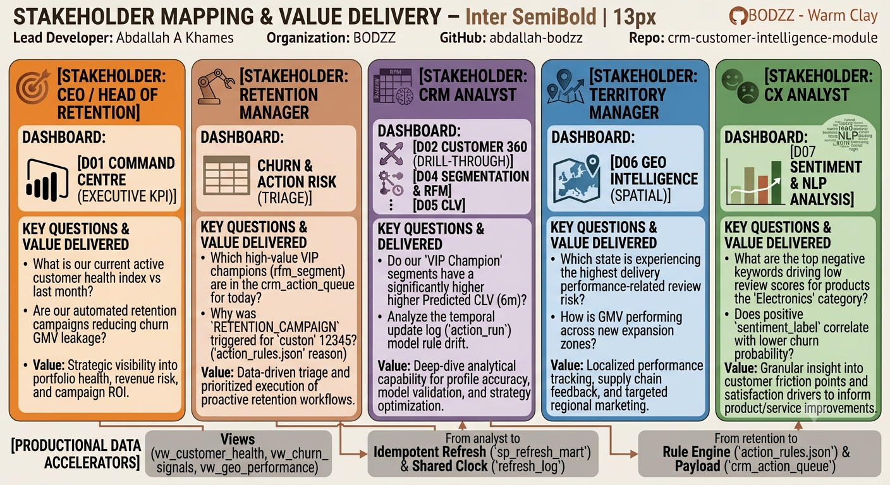

*Figure 7 — Stakeholder Mapping: dashboard pages mapped to business roles and decision workflows*

**Screenshots:**

<table>
<tr>
<td>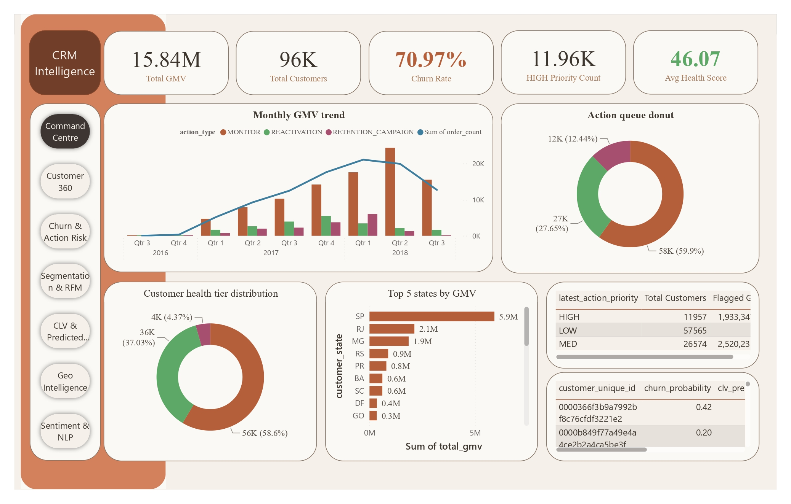</td>
<td>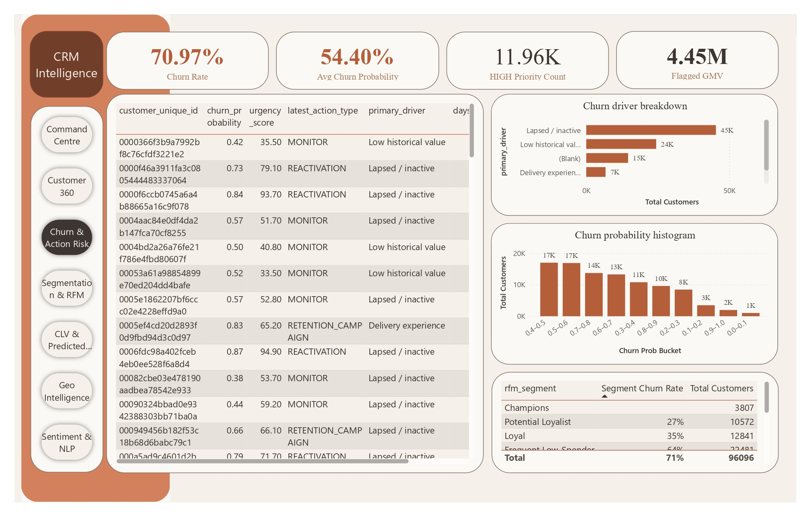</td>
</tr>
<tr>
<td>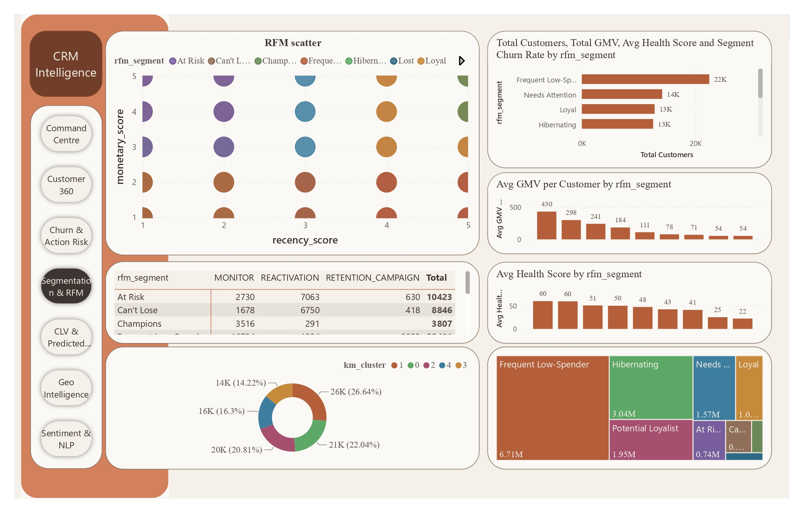</td>
<td>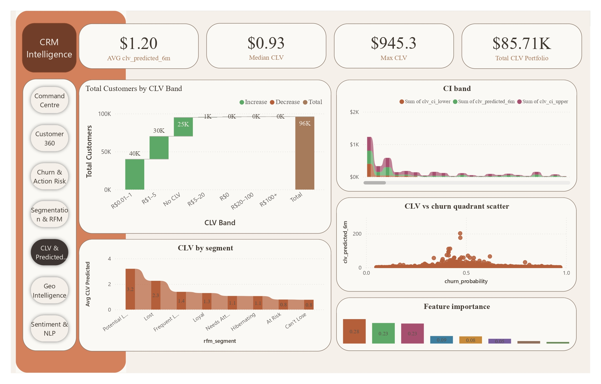</td>
</tr>
<tr>
<td>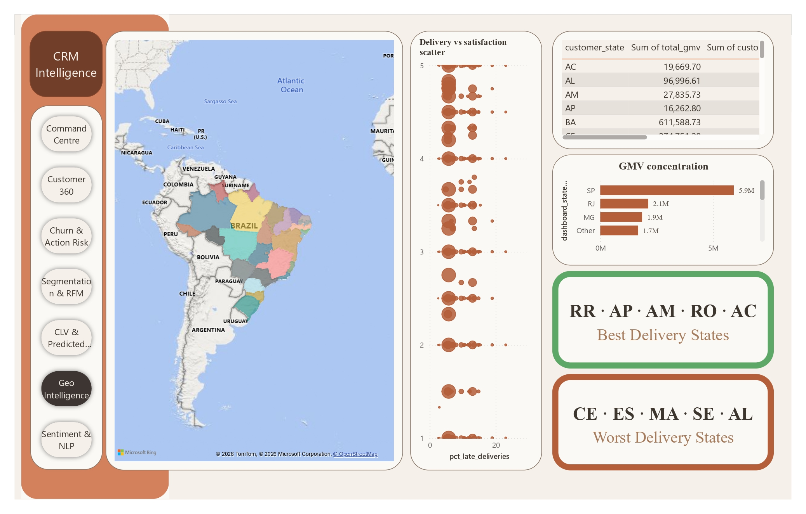</td>
<td>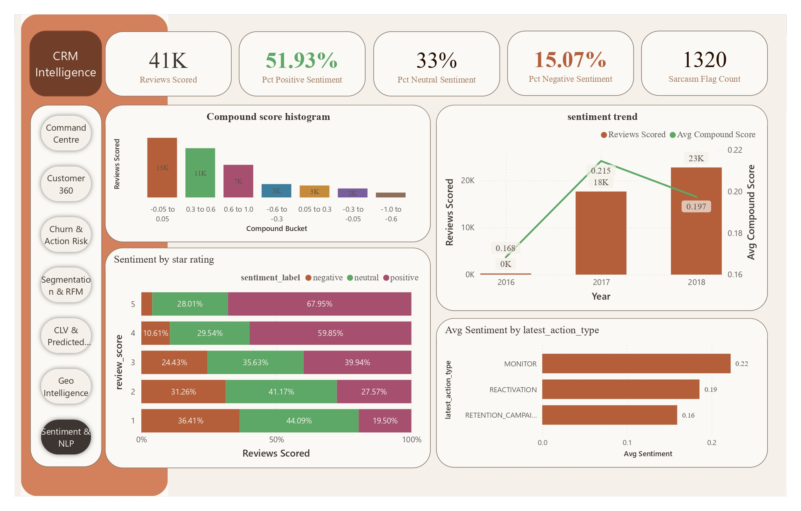</td>
</tr>
</table>

<details>
<summary>Customer 360 drill-through page</summary>
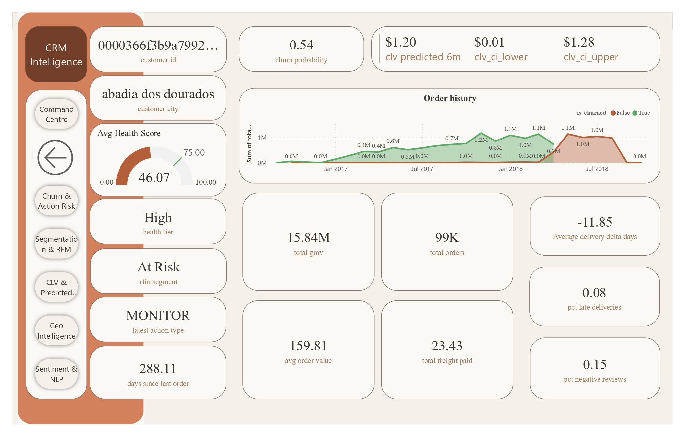
</details>

---

## Power BI themes — Warm Clay & Ember

This section deserves its own callout because it took longer than expected and the result is genuinely something I haven't seen done this thoroughly in open source Power BI projects.

Two complete, custom Power BI JSON themes built from scratch — not tweaked defaults, not a color swap on a template.

**Warm Clay** (light) — warm off-white base with terracotta and sage accents. Built for daylight viewing and PDF export; every visual type is specified so nothing falls back to Power BI's default palette.

**Ember** (dark) — deep brown-black with amber, sage, and muted coral. Built for presentations and screen-forward environments.

Both themes define:
- Typography across all Power BI text classes (callout, title, header, label, tooltip) using **DM Sans** and **Inter**
- Semantic color tokens (good/neutral/bad) for KPI cards, gauges, and conditional formatting — consistent across all 7 pages
- Visual-specific overrides for every chart type in this report: cards, tables, matrices, line charts, scatter plots, filled maps, slicers, KPI visuals, funnels, and waterfall charts
- Data color palettes with fixed segment-to-color assignments so RFM segment colors never shift between pages or refreshes

I'm planning to submit both themes to the **Microsoft Fabric Community Themes Gallery**. When the submissions are accepted, the links will be added here.

> *Pending submission:*
> - **Warm Clay** — `[link to be added post-submission]`
> - **Ember** — `[link to be added post-submission]`

Both `.json` files are in `powerbi/`.

---

## What broke and how it was fixed

Production projects break. The discipline is in catching it, documenting it, and not pretending otherwise.

| Issue | Evidence that caught it | Fix |
|-------|------------------------|-----|
| **Churn model target leakage** | F1=1.0, feature importance=1.0 on `days_since_last_order`, all others 0.0 | Removed the feature. Corrected model: F1=0.85, AUC=0.80 |
| **CLV feature leakage** | Training features included post-cutoff transaction data via mart table | Rebuilt `prepare_design_matrix()` to pull directly from warehouse with `< cutoff` filter |
| **CLV frequency imputation wrong** | ~98% of rows imputed with median of multi-order customers (~1/month), producing false signal | Changed imputation to 0.0 for `order_frequency_per_month_pre_cutoff`; MAE improved |
| **RFM recency score inverted** | Champions segment showed 100% churn; Lost showed 0% churn | Changed `ORDER BY recency_days ASC` → `DESC`; rebuilt all Gold tables |
| **CLV columns blank in Power BI** | 0 non-null rows from view despite 71,186 predictions in `clv_features` | `vw_customer_health` referenced `c360.clv_predicted_6m` (dead column) instead of `clv.clv_predicted_6m`; fixed alias; added regression check to `07_verify_mart.sql` |
| **`TRUNCATE` blocked by FK** | SQL Server runtime error on `sp_load_warehouse` | Switched FK-targeted dims to `DELETE`; retained `TRUNCATE` for fact tables |
| **Segmentation took 14+ minutes** | Full pairwise silhouette across 96k rows × 5 K values = ~4.6B comparisons | `sample_size=8000`; runtime → ~20 seconds |
| **Missing `expected_next_purchase_days` column** | `Invalid column name` on first next_purchase.py run | Non-destructive `ALTER TABLE ADD COLUMN` migration script |
| **`lifelines` crashes on all-NaN column** | `avg_sentiment_score` 100% NULL during dry run; `fillna(NaN)` is a silent no-op | Explicit median-undefined fallback to 0.0 with warning log |
| **Action queue INSERT column mismatch** | `Invalid column name 'clv_predicted_6m'` on first action_rules.py run | Corrected `INSERT_ACTION_SQL` to match actual DDL |
| **RFM rule set 61.6% uncovered** | Brute-force enumeration of all 125 (R,F,M) combinations | Four additional segments added; exhaustiveness verified at startup |
| **`review_id` not globally unique** | Duplicate key violation on `dim_review` | `ROW_NUMBER()` dedupe on latest `review_creation_date` + `order_id ASC` |
| **`urgency_score` direction inconsistency** | CLV-available and fallback branches measured opposite directions of value-at-stake | Both branches aligned: higher value at stake = higher urgency in all code paths |

---

## Key analytical figures

<table>
<tr>
<td align="center">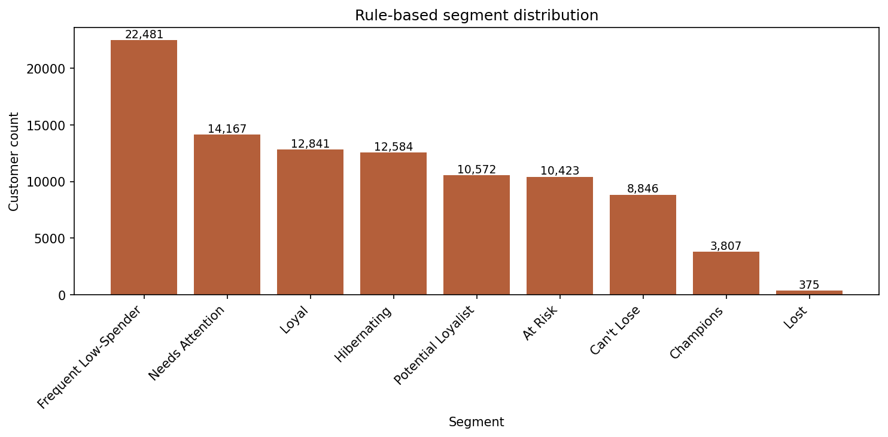<br/><sub>RFM Segment Distribution</sub></td>
<td align="center">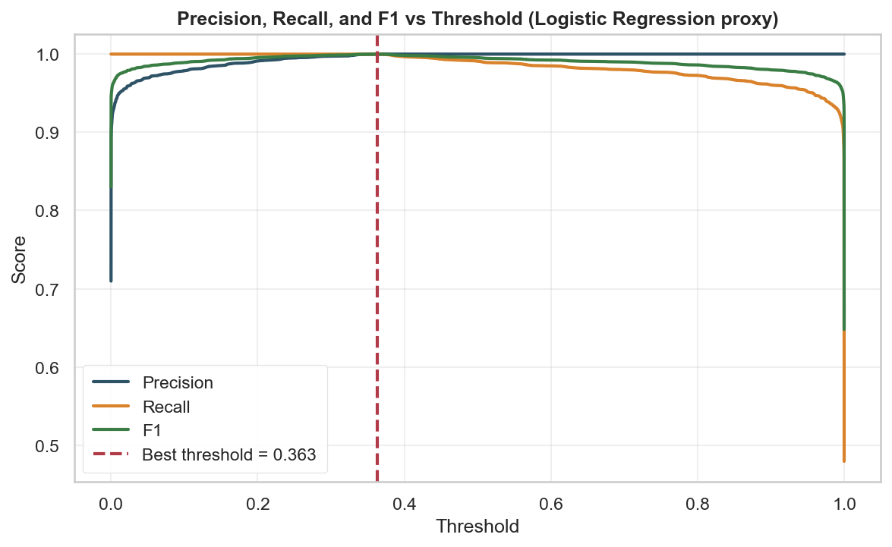<br/><sub>Churn Threshold Tuning (F1)</sub></td>
</tr>
<tr>
<td align="center">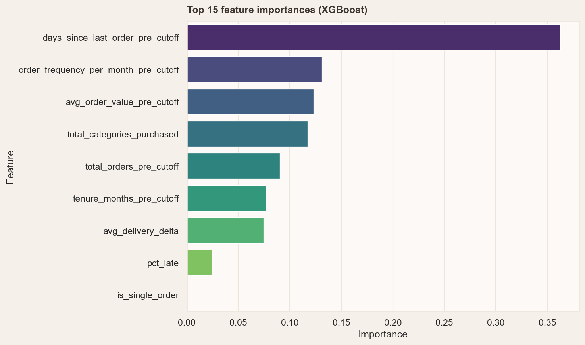<br/><sub>CLV Feature Importance</sub></td>
<td align="center">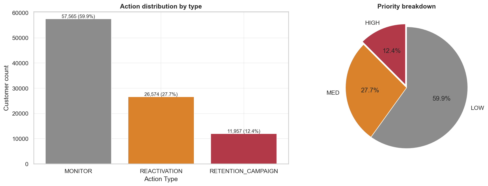<br/><sub>CRM Action Queue Distribution</sub></td>
</tr>
<tr>
<td align="center">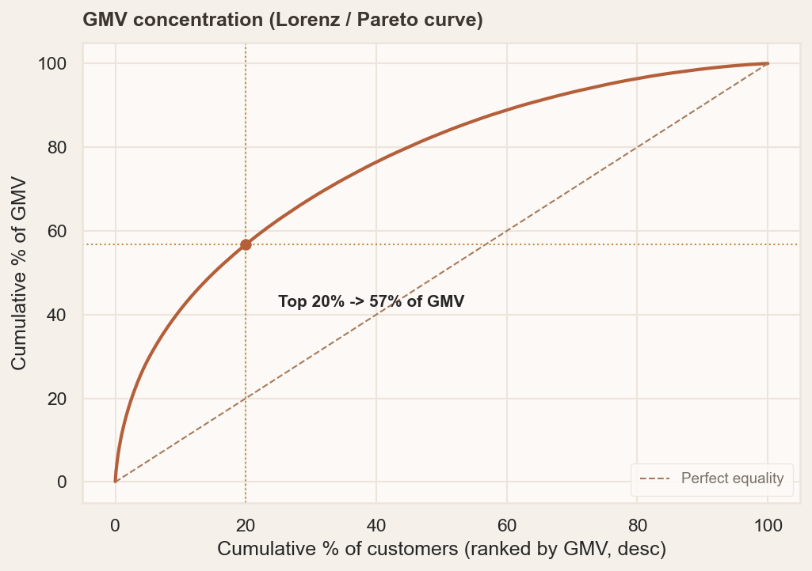<br/><sub>GMV Concentration (Pareto)</sub></td>
<td align="center">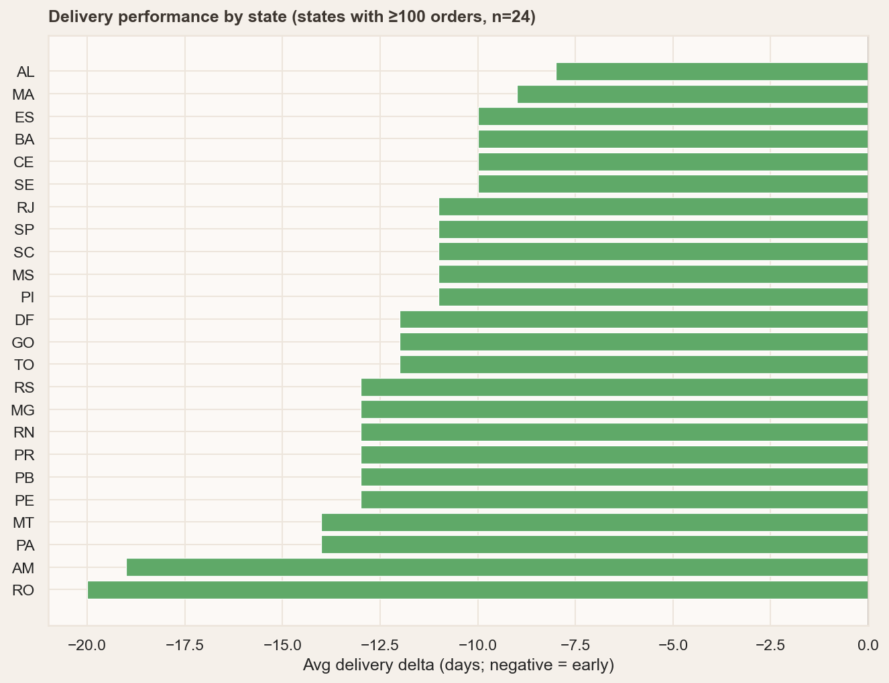<br/><sub>Delivery Performance by State</sub></td>
</tr>
</table>

---

## Documentation

| Document | Location | Contents |
|----------|----------|----------|
| **Business Case** | `case_study/business_case.md` | Full writeup — architecture decisions, model results, action engine analysis, ROI scenarios, full bug log |
| **Data Dictionary** | `docs/data_dictionary.md` | Complete column reference for all 13 tables and 3 views |
| **Phase 2 — EDA & Bronze** | `docs/02-eda-bronze-validation.md` | Decisions locked during EDA; ML cutoff rationale; structural data findings |
| **Phase 3 — Silver** | `docs/03-silver-layer-warehouse.md` | SCD2 design; point-in-time join; bug log |
| **Phase 4 — Gold** | `docs/04-gold-layer-mart.md` | Mart design; health score formula; view logic; corrections to prior drafts |
| **Phase 5 — ML Pipeline** | `docs/05-ml-pipeline.md` | All model results; bugs documented with evidence and fixes |
| **Phase 6 — Power BI** | `docs/06-power-bi-dashboards.md` | Dashboard spec; CLV column bug; full bookmark inventory |
| **Power BI Build Guide** | `powerbi/PowerBI_Dashboard_Implementation_Guide.md` | Every visual, field, DAX formula, and bookmark — rebuild from scratch |
| **DAX Script** | `powerbi/CRM_Intelligence_Measures.dax.md` | All 29 measures + 7 calculated columns |
| **DQ Report** | `reports/dq_report.html` | Post-pipeline ML prediction coverage and range validation (auto-generated) |

---

## Technology stack

| Layer | Technology |
|-------|------------|
| Database | SQL Server 2019+ |
| ETL | Python 3.11 + SQLAlchemy + pyodbc |
| Data manipulation | pandas + numpy |
| ML — gradient boosting | XGBoost 2.x |
| ML — clustering | scikit-learn (K-means, silhouette) |
| ML — survival analysis | lifelines ≥ 0.30.0 (WeibullAFTFitter) |
| NLP — sentiment | LeIA (Portuguese VADER, `rafjaa/LeIA`) |
| Visualisation | Power BI Desktop |
| Notebooks | Jupyter |
| Config / secrets | python-dotenv |
| CLI output | rich |
| Version control | Git + GitHub |

---

## Setup

### Prerequisites

- SQL Server 2019+
- Python 3.11
- Power BI Desktop
- ODBC Driver 17 for SQL Server

### Install

```bash
pip install -r requirements.txt
```

LeIA is bundled in `python/LeIA_lib/` — no separate install needed.

### Configure

```bash
cp .env.example .env
# Edit .env:
# DB_SERVER=your_server
# DB_NAME=CRM_Analytics
# DB_TRUSTED_CONNECTION=yes
```

### Run

**Step 1 — SQL setup** (run in SSMS or sqlcmd, in order):

```sql
-- Bronze
sql/00_setup/00_setup_bronze_staging.sql

-- Silver
sql/02_warehouse/01_dim_date.sql
sql/02_warehouse/02_dim_customer.sql
sql/02_warehouse/03_dim_seller.sql
sql/02_warehouse/04_dim_product.sql
sql/02_warehouse/05_dim_review.sql
sql/02_warehouse/06_fact_orders.sql
sql/02_warehouse/07_fact_order_items.sql
sql/02_warehouse/08_sp_load_warehouse.sql

-- Gold
sql/03_mart/00_refresh_log.sql
sql/03_mart/01_customer_360.sql
sql/03_mart/02_rfm_features.sql
sql/03_mart/03_clv_features.sql
sql/03_mart/04_sentiment_scores.sql
sql/03_mart/05_crm_action_queue.sql
sql/03_mart/09_action_run_log.sql
sql/03_mart/06_sp_refresh_mart.sql

-- Views
sql/04_views/01_vw_customer_health.sql
sql/04_views/02_vw_churn_signals.sql
sql/04_views/03_vw_geo_performance.sql
```

**Step 2 — Ingest Bronze:**
```bash
cd python && python ingest_bronze.py
```

**Step 3 — Build Silver:**
```sql
EXEC warehouse.sp_load_warehouse;
```

**Step 4 — Build Gold:**
```sql
EXEC mart.sp_refresh_mart;
```

**Step 5 — ML pipeline:**
```bash
python run.py --all           # full pipeline
python run.py --all --dry-run # no DB writes
python run.py --churn --threshold 0.35  # individual step with override
```

**Step 6 — Action queue:**
```bash
python action_rules.py
python action_rules.py --dry-run
python action_rules.py --churn-threshold 0.5 --vip-percentile 85
```

**Step 7 — DQ report:**
```bash
python dq_report.py --open    # writes reports/dq_report.html
```

**Step 8 — Power BI:**

Open `powerbi/CRM_Customer_Intelligence.pbix` in Power BI Desktop. Update the data source connection to your SQL Server instance. Refresh.

---

## License

MIT. See [LICENSE](LICENSE).

Dataset: [Brazilian E-Commerce Public Dataset by Olist](https://www.kaggle.com/datasets/olistbr/brazilian-ecommerce) — licensed under CC BY-NC-SA 4.0. See [CITATION.cff](CITATION.cff).

---

<div align="center">

**Abdallah A Khames** · [BODZZ](https://github.com/abdallah-bodzz) · `crm-customer-intelligence-module`

*Enterprise CRM Intelligence · Customer MDM · Predictive Analytics · Operational CRM Action Engine*

*If something here is useful — the LeIA integration pattern, the Weibull AFT approach, the SCD2 point-in-time join, the action engine design, or the Power BI themes — take it.*

</div>