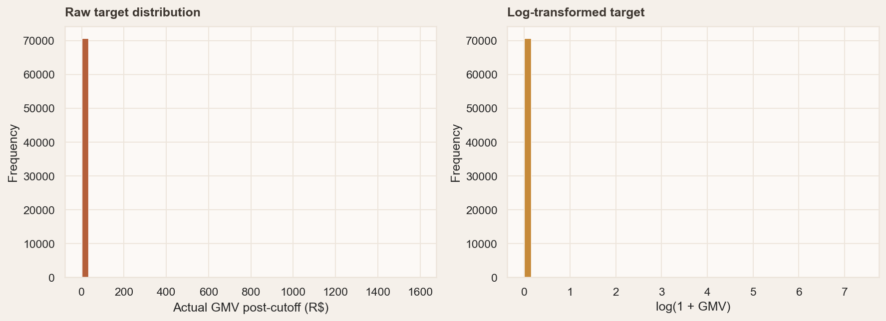
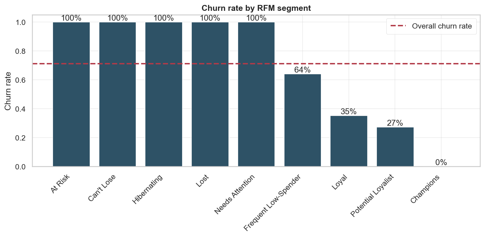
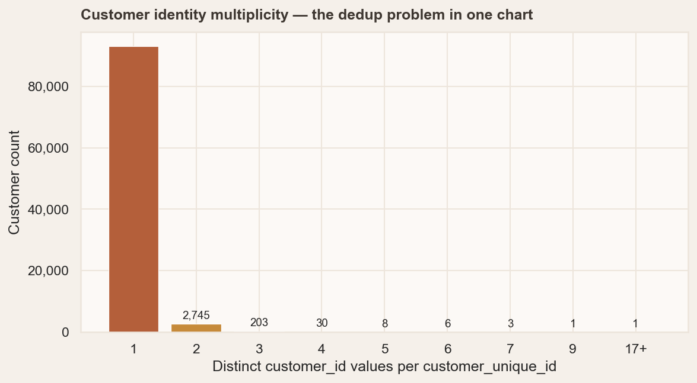
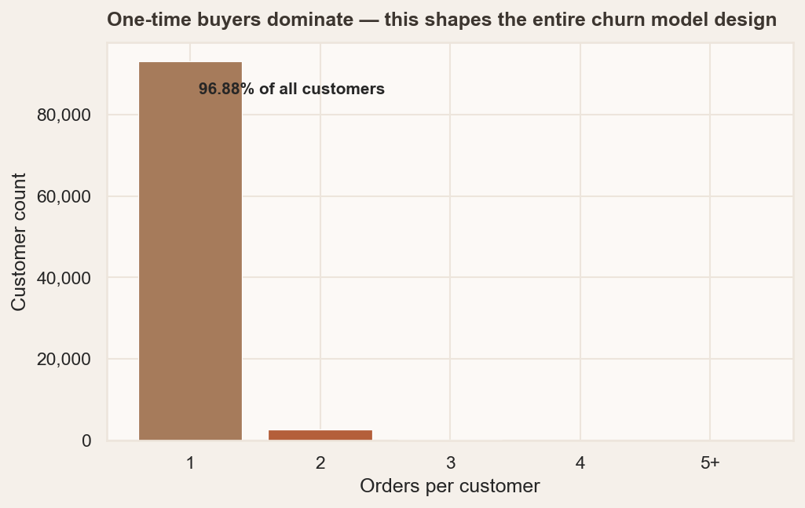
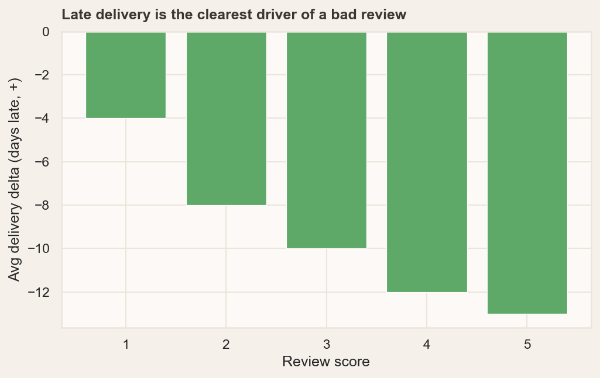
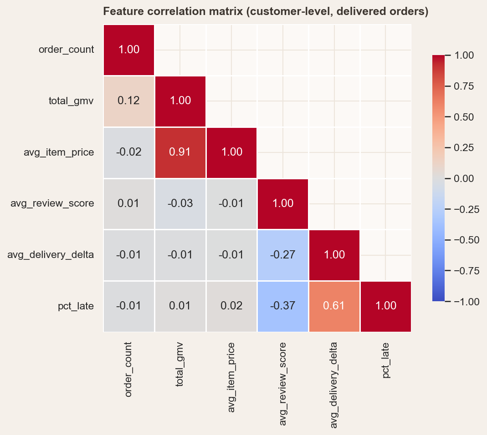
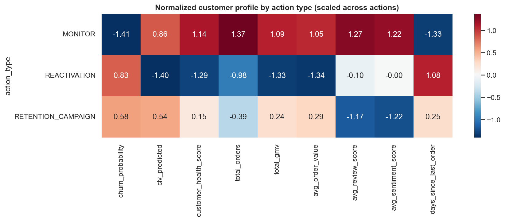
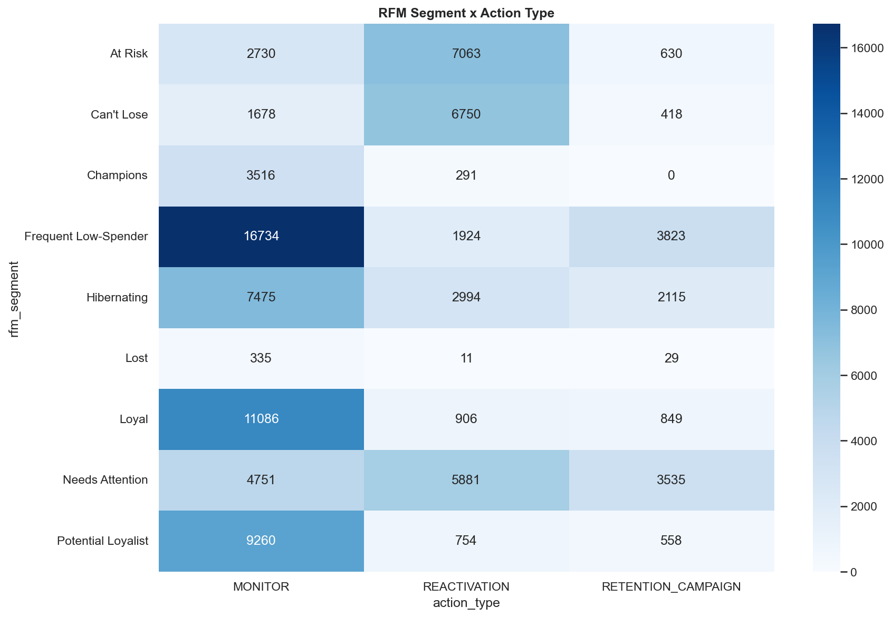
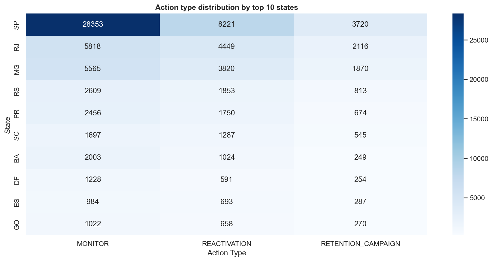
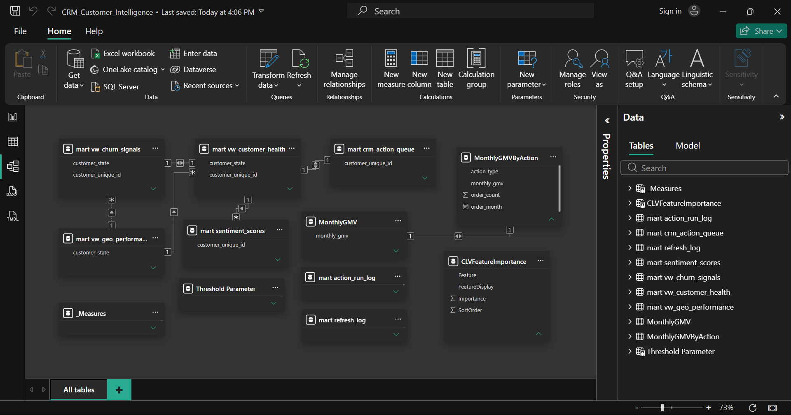

<div align="center">

# Enterprise CRM Intelligence & Customer 360 Platform — Business Case

[](https://www.microsoft.com/en-us/sql-server)
[](https://python.org)
[](https://xgboost.readthedocs.io)
[](https://lifelines.readthedocs.io)
[](https://powerbi.microsoft.com)
[](https://scikit-learn.org)
[](https://github.com/rafjaa/LeIA)
[](../LICENSE)
[]()

**Lead Developer:** Abdallah A Khames &nbsp;|&nbsp; **Organisation:** BODZZ &nbsp;         
&nbsp; **GitHub:** [`abdallah-bodzz`](https://github.com/abdallah-bodzz) &nbsp;|&nbsp; **Repo:** [`crm-customer-intelligence-module`](https://github.com/abdallah-bodzz/crm-customer-intelligence-module) &nbsp;|&nbsp; **Version:** 1.0 &nbsp;|&nbsp; **Date:** 2026-06

</div>

---

## Table of Contents

1. [Executive Summary](#1-executive-summary)
2. [Business Context](#2-business-context)
3. [Architecture & Technical Approach](#3-architecture--technical-approach)
4. [Data Pipeline](#4-data-pipeline)
5. [Machine Learning Pipeline](#5-machine-learning-pipeline)
6. [Key Findings & Analytics](#6-key-findings--analytics)
7. [CRM Action Engine](#7-crm-action-engine)
8. [Power BI Dashboards](#8-power-bi-dashboards)
9. [Business Impact & ROI](#9-business-impact--roi)
10. [Engineering Decisions & What Broke](#10-engineering-decisions--what-broke)
11. [Technology Stack](#11-technology-stack)
12. [Appendix — Artifacts](#12-appendix--artifacts)

---

## 1. Executive Summary

| Dimension | Detail |
|-----------|--------|
| **The Problem** | Olist operates with fragmented customer identities and a 71.18% structural churn baseline that drowns actionable signals. 96.88% of customers place a single order — making standard retention analytics effectively useless without a proper Customer Master Data Management (MDM) layer and predictive segmentation. |
| **The Solution** | A production-grade **Enterprise CRM Intelligence Platform** built on a Medallion Lakehouse architecture (Bronze → Silver → Gold), delivering: SCD Type 2 Customer MDM, five predictive ML models (Sentiment · Segmentation · CLV · Churn · Next-Purchase Timing), and an operational **CRM Action Engine** that translates ML predictions into prioritised retention and reactivation tasks — all wired end-to-end into a seven-page stakeholder BI platform. |
| **The Scale** | 96,096 unified customer records · 1.55M rows across 9 source tables · R$15.84M total GMV · 29 DAX measures · 5 trained models · 7 dashboard pages |
| **The Impact** | 11,957 HIGH-priority customers flagged for retention campaigns. 38,531 customers (40.1%) assigned actionable CRM interventions. Champions segment (3,807 customers) maintains 0% churn. Top 5 Brazilian states account for 73.9% of GMV. |

**Architecture reference:** This platform is modelled after the customer entity structure and campaign automation patterns of **SAP CRM** and **Odoo CRM** — with particular emphasis on Customer Master Data Management (MDM) with SCD2 history tracking, point-in-time transactional joins, and an operational action queue that converts ML predictions into executable business tasks, not just reports.

---

## 2. Business Context

### 2.1 The Enterprise CRM Problem in E-Commerce

E-commerce platforms generate enormous volumes of customer transaction data — orders, payments, reviews, delivery performance. Without a unified customer master and predictive intelligence layer, core CRM and Revenue Operations (RevOps) questions cannot be answered reliably:

- Which customers are at churn risk, and what behavioural pattern is driving it?
- What is the forward-looking Customer Lifetime Value (CLV) of each account?
- Which customers justify premium retention spend vs. cost-efficient reactivation?
- What regional delivery failures are degrading customer satisfaction and increasing churn?
- How should the CRM action queue be prioritised across 96k accounts?

These are not reporting questions. They are operational questions that require a data architecture — not a spreadsheet.

### 2.2 Olist's Specific Challenges

The Olist dataset — 100,000 orders across 2016–2018 from a Brazilian multi-seller marketplace — presents three structural challenges that make it a realistic enterprise CRM case study, not a clean academic exercise:

| Challenge | Root Cause | Magnitude |
|-----------|------------|-----------|
| **Fragmented customer identity** | Olist issues a fresh `customer_id` per order — the same customer appears as multiple accounts in operational tables; a classic MDM problem | 3.12% of customers affected; up to 17 `customer_id` values per individual |
| **Structural churn baseline** | Most customers never return — churn is the platform's default state, not a behavioural exception; requires `scale_pos_weight` in ML training | 96.88% one-time buyers · 71.18% baseline churn |
| **Sparse, skewed review coverage** | Sentiment data exists for fewer than half of customers, biased toward dissatisfied voices | 41.29% text coverage · 1-star reviews are 76% text-covered |

Each of these isn't just a data quality note — it's an architectural constraint that shaped every decision from SCD2 design to ML threshold selection to dashboard defaults.

---

## 3. Architecture & Technical Approach

### 3.1 High-Level Solution Architecture

<div align="center">


**Figure 1 — High-Level Solution Architecture**
*Medallion Lakehouse (Bronze → Silver → Gold) with Python ML Pipeline and Power BI BI Layer*

</div>

The solution implements a three-layer **Medallion Lakehouse Architecture** on SQL Server, with a Python ML pipeline feeding predictions back into the Gold layer and a Power BI import-mode BI layer consuming the result:

```
Source Data (9 CSV files · 1.55M rows)
       │
       ▼  ingest_bronze.py
┌─────────────────────────────────────────┐
│  BRONZE  ·  staging schema              │
│  Raw ingest · 1:1 with source          │
│  Immutable audit layer                 │
│  +load_timestamp · +source_file        │
└─────────────┬───────────────────────────┘
              │  sp_load_warehouse
              ▼
┌─────────────────────────────────────────┐
│  SILVER  ·  warehouse schema            │
│  Customer MDM — SCD Type 2             │
│  Star schema · FK constraints          │
│  Persisted computed columns            │
└─────────────┬───────────────────────────┘
              │  sp_refresh_mart
              ▼
┌─────────────────────────────────────────┐
│  GOLD  ·  mart schema                   │
│  Customer 360° · RFM Features          │
│  CLV Features · Sentiment Scores       │
│  CRM Action Queue · Refresh Log        │
│  3 analytical views                    │
└─────────────┬───────────────────────────┘
              │  run.py (subprocess-isolated)
              ▼
┌─────────────────────────────────────────┐
│  Python ML Pipeline                     │
│  Sentiment → Segmentation →            │
│  CLV → Churn → Next-Purchase →         │
│  CRM Action Engine                     │
└─────────────┬───────────────────────────┘
              │  Power BI Import Mode
              ▼
┌─────────────────────────────────────────┐
│  Stakeholder BI Platform (7 pages)      │
│  Executive · Retention · Analyst ·     │
│  Revenue · Territory · CX              │
└─────────────────────────────────────────┘
```

### 3.2 End-to-End Data Flow

<div align="center">


**Figure 2 — End-to-End Data Flow**
*From raw source ingestion through ETL, ML predictions, and operational action generation*

</div>

### 3.3 Key Architectural Decisions

**Customer Master Data Management (MDM) — SCD Type 2**
`customer_unique_id` is the MDM business key; `customer_id` is the operational key (N:1 from Olist's order-per-customer-ID scheme, a real-world identity fragmentation problem). Each SCD2 version tracks changes to city, state, and ZIP with `valid_from`, `valid_to`, and `is_current`. A filtered unique index enforces exactly one current row per customer at the database level — not just in ETL discipline. This mirrors the customer master management approach used in SAP S/4HANA Customer Management and Odoo's `res.partner` with version history.

**Point-in-Time Transactional Joins**
`fact_orders` links to `dim_customer` via a priority-ranked `CROSS APPLY`. On fresh loads — where all `valid_from` dates are set to today, after all historical order dates — a fallback to the earliest known version ensures no orders are dropped. This is the production pattern that enterprise ERP data warehouses use and that most tutorials skip entirely.

**Persisted Computed Columns**
Delivery delta, late flag, GMV, freight ratio, and customer health tier are computed once at insert time and stored physically. The BI layer never recalculates them on each refresh — a deliberate performance pattern that holds at scale and ensures derived values cannot drift from their source.

**Shared Clock via `refresh_log`**
A singleton `mart.refresh_log` table carries `as_of_date`, `ml_cutoff_date`, and `churn_window_days`. Every view reads from this table — eliminating the class of drift bug where two views independently recompute `MAX(order_date)` and diverge. This is the Gold layer's equivalent of a reference data management pattern.

**Leakage-Free CLV Feature Construction**
Features for the CLV model are recomputed from warehouse tables with an explicit `order_purchase_timestamp < cutoff_date` filter — not read from `mart.clv_features`. This is standard practice in enterprise CLV modeling (BG/NBD, Pareto/NBD, any supervised approach) and is the correct way to implement a temporal train/test split at the feature-matrix level, not just the row level.

---

## 4. Data Pipeline

### 4.1 Bronze Layer — Raw Ingest (Data Integration)

Nine CSV files loaded into `staging` schema with zero transforms. Every table receives `load_timestamp` and `source_file` audit columns. The layer is immutable — it is the data integration audit trail, not the computation surface. This mirrors the **staging area** pattern in enterprise ETL architecture (Kimball DW lifecycle, SAP BODS source layer).

| Table | Source | Rows |
|-------|--------|------|
| `stg_orders` | olist_orders_dataset.csv | 99,441 |
| `stg_customers` | olist_customers_dataset.csv | 99,441 |
| `stg_order_items` | olist_order_items_dataset.csv | 112,650 |
| `stg_order_payments` | olist_order_payments_dataset.csv | 103,886 |
| `stg_order_reviews` | olist_order_reviews_dataset.csv | 99,224 |
| `stg_products` | olist_products_dataset.csv | 32,951 |
| `stg_sellers` | olist_sellers_dataset.csv | 3,095 |
| `stg_geolocation` | olist_geolocation_dataset.csv | ~1M+ |
| `stg_product_category_translation` | product_category_name_translation.csv | 71 |

**Bronze validation:** All 9 tables matched expected Kaggle-documented row counts. Zero nulls on critical FK columns. Soft nulls (delivery dates, review text) documented and propagated to Silver.

### 4.2 Silver Layer — Customer MDM & Warehouse Build

Seven tables in the `warehouse` schema. All data is typed, deduplicated, and referentially constrained. ETL runs via `sp_load_warehouse` — idempotent, transactional, and fully documented. The Silver schema is the **Conformed Dimension layer** in Kimball terminology — the single authoritative source for all Gold mart tables and ML features.

<div align="center">


**Figure 3 — Customer Master Data Management (MDM) — SCD Type 2 Implementation**
*`customer_unique_id` business key · version history · database-enforced current-row integrity*

</div>

| Table | Type | Grain | Key Design Notes |
|-------|------|-------|-----------------|
| `dim_date` | Dimension | 1 row per date | 2015–2020 + 1900-01-01 sentinel; Brazilian fixed-date holidays; fiscal columns |
| `dim_customer` | **SCD Type 2 (MDM)** | 1 row per version | Business key: `customer_unique_id`; filtered unique index on current rows; tracks city/state/zip changes |
| `dim_product` | Type 1 | 1 row per product | Category translated to English; `UNKNOWN` for nulls; `product_volume_cm3` persisted |
| `dim_seller` | Type 1 | 1 row per seller | Simple; no SCD2 required |
| `dim_review` | Type 1 | 1 row per `review_id` | Deduplicates Olist's documented duplicate `review_id` quirk via `ROW_NUMBER()`; `has_comment` flag |
| `fact_orders` | Fact | 1 row per order | Point-in-time SCD2 join; `delivery_delta_days`, `is_late`, `approval_delay_hours` as persisted columns; payment aggregates via `OUTER APPLY` |
| `fact_order_items` | Fact | 1 row per line item | `gmv`, `freight_ratio` persisted; `customer_unique_id` denormalized for fast rollups |

**Known Olist data quality issues handled:**
- `review_id` not globally unique in source — deduplicated with `ROW_NUMBER()` on latest `review_creation_date`
- `review_score` arrives as `FLOAT` — cast to `TINYINT` with `WHERE BETWEEN 1 AND 5` filter
- Date NULLs route to `1900-01-01` sentinel in `dim_date` (Kimball pattern — prevents NULL FKs)
- `TRUNCATE` blocked by FK constraints on dim tables — handled with `DELETE` on FK-targeted tables, `TRUNCATE` on facts

### 4.3 Gold Layer — CRM Mart & Customer 360°

Six mart tables plus three analytical views in the `mart` schema. The mart is fully disposable — `sp_refresh_mart` truncates and rebuilds every run. No FK dependencies on Silver by design, which keeps the mart independently auditable and verifiable.

<div align="center">


**Figure 4 — Gold Layer Mart Entity Relationship Diagram**
*`mart` schema: Customer 360° · RFM Features · CLV Features · Sentiment Scores · CRM Action Queue · Refresh Log*

</div>

| Table | Grain | Purpose | Python-populated columns |
|-------|-------|---------|--------------------------|
| `customer_360` | 1 per customer | **Unified Customer 360° record** — the CRM account master | `churn_probability`, `clv_predicted_6m`, `avg_sentiment_score`, `expected_next_purchase_days` |
| `rfm_features` | 1 per customer | RFM scores + quintile ranks | `rfm_segment`, `km_cluster` |
| `clv_features` | 1 per customer | ML feature matrix + CLV target variable | `clv_predicted_6m`, `clv_ci_lower`, `clv_ci_upper` |
| `sentiment_scores` | 1 per review | Review text + scored compound | `compound_score`, `sentiment_label` |
| `crm_action_queue` | 1 per action event | **Operational CRM action records** (Python-owned entirely) | Entire table (`action_rules.py`) |
| `refresh_log` | Singleton | Shared pipeline clock — reference data for all views | None — SQL-maintained |

**Three analytical views feeding the BI layer:**

- `vw_customer_health` — flat Customer 360° profile joining `customer_360` + `rfm_features` + `clv_features` + latest action per customer
- `vw_churn_signals` — at-risk customers with `primary_driver`, `urgency_score`, and `churn_driver_summary`
- `vw_geo_performance` — territory-level aggregates: GMV, customer count, churn rate, delivery performance

**Customer health score formula** (computed in SQL, stored as persisted column — cannot drift from its inputs):

```sql
customer_health_score = (recency_pct * 0.40) + (monetary_pct * 0.40) + (satisfaction_pct * 0.20)
```

All three inputs use `PERCENT_RANK()` percentiles — immune to whale-customer distortion. The top 20% of customers account for 56.8% of GMV; linear max-scaling would collapse everyone else's monetary score toward zero. Customers with zero reviews are imputed to the population median via `PERCENTILE_CONT(0.5) WITHIN GROUP ... OVER ()`, not to 0.

---

## 5. Machine Learning Pipeline

Five models run in dependency order through a subprocess-isolated orchestrator (`run.py`). Each script reads from Gold, writes predictions back to mart, and logs its own metrics independently. Every script is idempotent, supports `--dry-run`, and is independently executable.

### 5.1 Pipeline Overview

| Step | Script | Model Type | Reads From | Writes To | Rows Written |
|------|--------|-----------|-----------|-----------|--------------|
| 1 | `sentiment.py` | LeIA (Portuguese VADER) | `mart.sentiment_scores` | `compound_score`, `sentiment_label` | 40,641 |
| 2 | `segmentation.py` | Rule-based RFM + K-means (K=7) | `mart.rfm_features` | `rfm_segment`, `km_cluster` | 96,096 |
| 3 | `clv_model.py` | XGBoost Regressor + Quantile CI | `warehouse` (point-in-time, leakage-free) | `clv_predicted_6m`, `clv_ci_lower/upper` | 71,186 |
| 4 | `churn_model.py` | XGBoost Classifier (F1-tuned) | `mart.customer_360` | `churn_probability` | 96,096 |
| 5 | `next_purchase.py` | Weibull AFT (Survival Analysis) | `mart.customer_360` + `fact_orders` | `expected_next_purchase_days` | 2,996 |
| 6 | `action_rules.py` | JSON-driven Rule Engine | `mart.vw_customer_health` + `mart.clv_features` | `mart.crm_action_queue` | 96,096 |

### 5.2 Sentiment Analysis — PT-BR NLP (LeIA)

**Why LeIA, not VADER:** VADER's English-only lexicon silently scores Portuguese text as near-neutral — it doesn't flag unrecognised words, it returns ~0.0. That's a wrong-but-plausible-looking result with no error to flag it. LeIA is a deliberate Portuguese rebuild of VADER with a validated Brazilian Portuguese lexicon. Same API shape; different dictionary underneath.

| Metric | Value |
|--------|-------|
| Reviews scored | 40,641 (41.29% coverage) |
| Positive sentiment | 51.93% |
| Neutral sentiment | 33.00% |
| Negative sentiment | 15.07% |
| Mean compound score | 0.2048 |
| Standard deviation | 0.3818 |

Coverage is intentionally below 100% — only non-empty review text is scored. 58.71% of reviews have no comment. Customers with zero reviews receive population-median sentiment imputation downstream — conflating "no feedback" with "neutral feedback" at the row level would corrupt the per-review table.

### 5.3 Customer Segmentation — RFM + K-means

**Method:** Rule-based segment labels (deterministic, 9-segment scheme covering all 125 possible RFM score combinations — verified exhaustive by brute-force enumeration before production) + K-means clustering as an independent, data-driven complementary view.


*Figure 5 — RFM Customer Segment Distribution*

| Segment | Count | % | Churn Rate | Business Meaning |
|---------|-------|---|------------|-----------------|
| Frequent Low-Spender | 22,481 | 23.4% | 64.0% | Engaged but low-margin; frequency without basket size — upsell lever |
| Needs Attention | 14,167 | 14.7% | 100% | Moderate recency; sliding without intervention |
| Loyal | 12,841 | 13.4% | 35.3% | Strong base; some attrition worth monitoring |
| Hibernating | 12,584 | 13.1% | 100% | Gone quiet; cost-effective reactivation candidates |
| Potential Loyalist | 10,572 | 11.0% | 27.3% | Recent, promising; worth nurturing toward Loyal |
| At Risk | 10,423 | 10.8% | 100% | Were valuable; recency dropped sharply — priority for retention |
| Can't Lose | 8,846 | 9.2% | 100% | Historically high-value; now dormant — VIP reactivation candidates |
| **Champions** | **3,807** | **4.0%** | **0%** | Best customers; retention strategy is working |
| Lost | 375 | 0.4% | 100% | Long gone; recovery ROI is marginal |

**K-means result:** Optimal K=7 (silhouette = 0.3106). No degenerate clusters. Runtime optimised from 854s → ~20s via `sample_size=8000` on silhouette scoring.

### 5.4 Customer Lifetime Value (CLV) — XGBoost + Quantile Regression

**Model:** XGBoost Regressor for point prediction + two quantile regression models at α=0.1 and α=0.9 producing an 80% confidence interval via `objective='reg:quantileerror'`.

**Critical architectural decision — leakage-free feature construction:** The original plan pointed straight at `mart.clv_features` for training features. That is target leakage: the mart's feature columns are computed from a customer's entire order history — including post-cutoff orders, the exact period the target variable (`actual_gmv_post_cutoff`) is trying to predict. Features are instead recomputed directly from warehouse tables with an explicit `order_purchase_timestamp < '2018-05-01'` filter. This is standard practice in enterprise CLV modeling (BG/NBD, Pareto/NBD, any supervised approach).



*Figure 6 — CLV Target Distribution (zero-inflated at 99.21%)*

| Metric | Value | Interpretation |
|--------|-------|----------------|
| Training frame | 71,186 customers | All customers with ≥1 pre-cutoff order |
| Zero target rate | 99.21% | 96.88% one-time buyers; most have R$0 post-cutoff GMV |
| MAE | R$2.47 | Operationally relevant error metric |
| RMSE | R$19.17 | Root mean squared error |
| R² | −0.0507 | Expected on a zero-inflated target — not a model failure |

**Feature importance (top 5):**

| Feature | Importance |
|---------|------------|
| `days_since_last_order_pre_cutoff` | 0.28 |
| `avg_order_value_pre_cutoff` | 0.23 |
| `order_frequency_per_month_pre_cutoff` | 0.23 |
| `total_orders_pre_cutoff` | 0.09 |
| `tenure_months_pre_cutoff` | 0.08 |


*Figure 7 — CLV Model Feature Importance*

### 5.5 Churn Prediction — XGBoost Classifier (F1-Optimised)

**Model:** XGBoost Classifier with F1-optimised decision threshold — explicitly not the default 0.5, which is uninformative at 71% positive class rate.

**Churn definition:** No order placed within 180 days of last purchase date (evaluated at `as_of_date = 2018-10-17`). EDA-locked — not re-derived inside the model. `is_churned` in `mart.customer_360` is the single source of truth; `churn_model.py` reads this flag as its label and never recomputes it.

**Class imbalance handling:** `scale_pos_weight` set from the EDA-locked 71.18% churn rate, not the live training batch's class balance, for consistency with the project's single-source-of-truth discipline.


*Figure 8 — Churn Model F1 Threshold Optimisation*

| Metric | Value |
|--------|-------|
| F1-tuned threshold | 0.2990 |
| F1-score | 0.8499 |
| Precision | 0.7708 |
| Recall | **0.9469** |
| ROC-AUC | 0.7995 |

**Feature importance — top behavioural signals:**

| Feature | Importance | Signal |
|---------|------------|--------|
| `total_categories_purchased` | 0.116 | Purchase breadth = engagement depth |
| `total_freight_paid` | 0.103 | Cumulative spend correlates with retention |
| `customer_state_SP` | 0.103 | Regional delivery quality differential |
| `avg_delivery_delta_days` | 0.075 | Delivery experience directly predicts churn |
| `preferred_payment_type_debit_card` | 0.055 | Payment method correlates with purchase intent |

**Critical leakage caught and fixed:** `days_since_last_order` was originally included as a feature. Since `is_churned = (days_since_last_order > 180)`, the model learned the answer key — F1=1.0, threshold=0.9999, `feature_importances_[days_since_last_order] = 1.0`, all others 0.0. The feature was removed entirely. The corrected model learns genuine behavioural patterns.



*Figure 9 — Churn Rate by Customer Segment*

### 5.6 Next-Purchase Timing — Weibull AFT Survival Analysis

**Model:** Weibull Accelerated Failure Time (AFT) via `lifelines.WeibullAFTFitter`.

**Why survival analysis, not regression:** Inter-purchase intervals are right-censored. A customer who hasn't reordered in 200 days may still order tomorrow — or never. Survival analysis models this uncertainty correctly; a standard regression treats both cases identically and systematically biases predictions for overdue customers. This is the technique used in Salesforce Einstein and Adobe Campaign for next-best-action timing.

**Grain distinction:** Training grain is one row per inter-purchase interval (not one row per customer). A customer with N orders contributes (N-1) observed intervals + 1 right-censored interval (last order → `as_of_date`). `predict_median(..., conditional_after=days_since_last_order)` returns T|T>s — the expected remaining time correctly conditioned on survival-to-date via the Weibull curve shape, not a naive subtraction.

**Scope:** Customers with ≥2 orders only (2,996 customers, 3.12% of base). Single-order customers are out of scope by design — no observed interval to model. Concordance index 0.5254 reflects the population reality (96.88% one-time buyers) rather than a model deficiency.

---

## 6. Key Findings & Analytics

### 6.1 Customer Identity — The MDM Problem



*Figure 10 — Customer Identity Fragmentation (MDM Challenge)*

Olist issues a fresh `customer_id` per order. A naive `COUNT(DISTINCT customer_id)` reports 99,441 customers. The correct MDM-resolved count is **96,096** — a 3.36% overcount driven by 2,997 customers with multiple `customer_id` values (up to 17 per individual). This is the same class of customer identity fragmentation problem that motivates MDM projects in SAP S/4HANA and Salesforce Data Cloud.

SCD2 on `customer_unique_id` resolves this. Database-enforced current-row integrity via filtered unique index means the uniqueness guarantee lives in the schema — not in ETL discipline that can erode.

### 6.2 One-Time Buyer Dominance — Structural Churn Reality



*Figure 11 — Orders per Customer Distribution*

96.88% of customers place exactly one order. This is structural — inherent to a marketplace model — not behavioural. It cascades through every downstream design decision:

- Churn models require `scale_pos_weight` to prevent majority-class domination
- BI dashboards default to `order_count >= 2` to surface the actionable repeat-buyer segment
- Retention strategy must distinguish structural one-time buyers from drifting repeat customers (the addressable segment)
- CLV target is 99.21% zero — the model optimises for identifying the non-zero tail, not the distribution mean

### 6.3 GMV Concentration — Revenue Pareto


*Figure 12 — GMV Concentration (Pareto Analysis)*

The top 20% of customers contribute **56.8% of total GMV** — sharper than a standard 80/20. This directly justifies a tiered retention budget: `RETENTION_CAMPAIGN` (HIGH priority, premium spend) for high-CLV at-risk customers, and `REACTIVATION` (MED priority, cost-efficient nudge) for the rest.

**Total GMV:** R$15.84M across 96,096 customers. **AOV:** R$137.42 · **Median:** R$86.90 (right-skewed distribution).

### 6.4 Delivery Performance → Review Score → Churn



*Figure 13 — Review Score vs. Delivery Delay Correlation*

The relationship is strong and directional: late deliveries produce low scores, low scores predict churn. Review text coverage skews heavily toward dissatisfied customers (1-star: 76% text-covered; 5-star: significantly lower) — meaning the sentiment model receives the strongest signal exactly where the business needs it most.

### 6.5 Regional Delivery Variance — Territory Intelligence


*Figure 14 — Delivery Performance by Brazilian State*

Delivery performance varies from ~20 days early (best states) to on-time or late (worst states) — a variance large enough to materially affect review scores and downstream churn rates. This is the evidence base for `customer_state` as a required churn feature.

| Category | States | Operational Implication |
|----------|--------|------------------------|
| Best delivery | RO, AM, PA, MT, PE | Regional logistics benchmark |
| Worst delivery | CE, BA, ES, MA, AL | Priority logistics improvement candidates |
| Highest GMV | SP, RJ, MG, RS, PR | 73.9% of total GMV · 77.1% of customers |

### 6.6 Feature Correlation Analysis



*Figure 15 — Feature Correlation Matrix (EDA)*

Two high-multicollinearity pairs identified and handled:

| Pair | Correlation | Resolution |
|------|-------------|------------|
| `total_gmv` ↔ `avg_item_price` | 0.91 | Both retained; XGBoost handles collinearity via tree splits |
| `avg_delivery_delta` ↔ `pct_late` | 0.61 | Both retained; they capture different aspects of delivery failure |

---

## 7. CRM Action Engine

The `crm_action_queue` table is the output that separates this platform from a reporting project. ML predictions translate into prioritised operational tasks — the same pattern that **SAP CRM Campaign Automation**, **Salesforce Campaign Builder**, and **Odoo CRM action queues** use for retention and reactivation workflows.

<div align="center">


**Figure 16 — CRM Action Engine Process Flow**
*ML predictions → rule evaluation → prioritised action records + audit log*

</div>

### 7.1 Action Assignment Logic

Rules are defined in `action_rules.json` and validated at startup against the database's `CHECK` constraint — unknown action types, missing keys, and MONITOR not being last in `evaluation_order` all fail loudly rather than producing silent partial-writes:

| Action Type | Priority | Condition | Business Rationale |
|-------------|----------|-----------|-------------------|
| `RETENTION_CAMPAIGN` | HIGH | `churn_probability ≥ 0.60` AND `clv_predicted > median` | High-value account at risk — premium retention spend justified |
| `REACTIVATION` | MED | `churn_probability ≥ 0.60` AND `clv_predicted ≤ median` | At-risk but lower-value — cost-efficient reactivation appropriate |
| `MONITOR` | LOW | All others (exhaustive catch-all) | No high-priority conditions met |

Every action record includes a human-readable `trigger_reason` field:

> *"Churn risk 0.837 ≥ 0.60; CLV R$0.96 at 55th pct (≥ 50th) — high-value customer, premium retention warranted."*

CRM analysts can read and act on these records without querying model outputs directly. Each execution is logged to `mart.action_run_log` with threshold history, count breakdowns, and a full config snapshot for audit purposes.

### 7.2 Action Distribution


*Figure 17 — CRM Action Queue Distribution*

| Action Type | Priority | Count | % of Customer Base |
|-------------|----------|-------|-------------------|
| `RETENTION_CAMPAIGN` | HIGH | 11,957 | 12.4% |
| `REACTIVATION` | MED | 26,574 | 27.7% |
| `MONITOR` | LOW | 57,565 | 59.9% |
| **Total actionable** | | **38,531** | **40.1%** |

### 7.3 Action Profile — Customer Intelligence



*Figure 18 — Action Profile Heatmap (Churn · CLV · Health · Recency by Action Type)*

| Action Type | Avg Churn Prob | Avg CLV | Avg Health Score | Avg Days Since Last Order |
|-------------|---------------|---------|-----------------|--------------------------|
| `RETENTION_CAMPAIGN` | 0.72 | R$1.36 | 44.5 | 324 days |
| `REACTIVATION` | 0.76 | R$0.74 | 32.6 | 367 days |
| `MONITOR` | 0.41 | **R$1.46** | 52.6 | 244 days |

**Key operational insight:** MONITOR customers have the highest CLV (R$1.46) and lowest churn probability (0.41) — they are the best-performing accounts and should not be over-contacted. `RETENTION_CAMPAIGN` customers have high churn (0.72) and meaningful CLV (R$1.36) — premium intervention spend is justified. `REACTIVATION` customers have the highest churn (0.76) but lowest CLV (R$0.74) — email drip or low-cost nudge is the appropriate channel.

### 7.4 Segment × Action Cross-Analysis



*Figure 19 — Segment × Action Cross-Analysis Heatmap*

Notable findings:

- **Champions → RETENTION_CAMPAIGN: 0 customers.** The engine correctly does not flag the healthiest segment for emergency intervention.
- **At Risk / Can't Lose → primarily REACTIVATION:** These are dormant high-value customers — lower forward CLV reflects elapsed time, not their historical account value.
- **Frequent Low-Spender → distributed across all action types:** The largest segment (23.4%) is heterogeneous; the engine differentiates within it correctly via the CLV × churn threshold matrix.

### 7.5 Geographic Action Distribution



*Figure 20 — Geographic CRM Action Distribution by State*

SP (São Paulo) dominates all action categories in absolute terms (37.4% GMV share), but its churn rate (68.0%) is below the national baseline — reflecting better delivery performance. RJ and MG show higher relative churn rates and proportionally larger actionable queues.

---

## 8. Power BI Dashboards — Stakeholder BI Platform

Seven pages built on imported Gold views. All DAX measures live in a dedicated `_Measures` table — no calculated columns where SQL can do the work. Import mode was chosen over DirectQuery: the analytical views contain complex window functions and multi-table joins; DirectQuery latency at 96k rows would be unusable for business users.

### 8.1 Customer 360° Conceptual View

<div align="center">


**Figure 21 — Customer 360° Conceptual View**
*Unified account record combining MDM identity, transactional history, predictive signals, and CRM action status*

</div>

The Customer 360° page is the operational core of the BI platform — a drill-through target from all six other pages, giving account managers, customer success teams, and retention analysts a single-screen view of every dimension of a customer record without writing SQL.

### 8.2 Stakeholder Mapping & Use Cases

<div align="center">


**Figure 22 — Stakeholder Mapping & Dashboard Use Cases**
*Seven dashboard pages mapped to six distinct business stakeholder profiles*

</div>

| Page | Primary Stakeholder | Core Use Case |
|------|--------------------|-|
| Command Centre | CEO / Head of Retention | Portfolio KPIs · action distribution · GMV trend · health tier · top territories |
| Customer 360 | Customer Success / Account Manager | Single-account record — identity · orders · delivery · sentiment · action |
| Churn & Action Risk | Retention Manager | Daily operational triage · ranked queue · driver breakdown · What-If simulator |
| Segmentation & RFM | CRM Analyst | Segment strategy · RFM scatter · segment-action heatmap · K-means cluster toggle |
| CLV & Predicted Value | Revenue Forecasting / RevOps | Value distribution · CI band · actual vs predicted scatter · value quadrant |
| Geo Intelligence | Territory Manager | Brazil filled map · state rankings · delivery vs satisfaction scatter |
| Sentiment & NLP | CX Analyst / VOC Team | Compound score distribution · monthly sentiment trend · sarcasm detection |

### 8.3 Dashboard Screenshots

**Command Centre** — executive portfolio snapshot


---

**Customer 360** — unified account record, drill-through from all pages


---

**Churn & Action Risk** — operational triage with What-If threshold simulator


---

**Segmentation & RFM** — segment distribution with K-means toggle


---

**CLV & Predicted Value** — value distribution with 80% confidence interval bands


---

**Geo Intelligence** — Brazil filled map with bookmark-driven metric switching (GMV / Churn / Late / Review)


---

**Sentiment & NLP** — review analysis with compound score trend


---

**Data model view** — star schema relationships in Import mode



### 8.4 Technical Implementation Decisions

| Decision | Rationale |
|----------|-----------|
| **Import mode** (not DirectQuery) | Views contain complex joins and window functions; DirectQuery latency at analytical scale would be unusable |
| **One flat view `vw_customer_health`** | Eliminates maintaining 3 separate table relationships in Power BI; single refresh point |
| **Left navigation rail + 14 bookmarks** | Hides default page tabs; active-state indicator; 4 metric-switchers + 2 view toggles + 4 panel toggles + navigation |
| **Aggregated RFM scatter (125 rows)** | 96k individual scatter points freeze Power BI; pre-grouped by R/F/M score combinations in SQL |
| **What-If threshold parameter (0.2–0.9)** | Business users adjust churn threshold without touching Python or SQL — the RevOps feedback loop |
| **`_` prefix on diagnostic measures** | Sorts diagnostic measures below production measures in the field list |
| **Two custom JSON themes** | Warm Clay (light, PDF export) and Ember (dark, presentations) — built from scratch, not modified defaults |

**Validation:** DAX `EVALUATE` block returns `"PASS — all checks cleared"`. Total GMV = R$15.84M. Total Customers = 96,096. HIGH Priority Count = 11,957. All 14 bookmarks functional. Drill-through to Customer 360 works from all pages.

---

## 9. Business Impact & ROI

### 9.1 Platform Delivery Metrics

| Metric | Value |
|--------|-------|
| Customer records unified (post-MDM) | 96,096 |
| Duplicate customer IDs resolved | 3,345 (99,441 → 96,096) |
| Total GMV modelled | R$15.84M |
| HIGH-priority retention candidates | 11,957 (12.4%) |
| Total actionable CRM queue | 38,531 (40.1%) |
| Champions segment churn rate | **0%** |
| Churn model ROC-AUC | 0.7995 |
| Churn model F1-score | 0.8499 |
| Churn model Recall | **0.9469** |
| Sentiment coverage (reviews with text) | 41.29% (40,641 reviews scored) |
| Top 5 states GMV share | 73.9% |
| Next-purchase model scope | 2,996 repeat buyers |
| DAX measures delivered | 29 |
| Dashboard pages | 7 (+ tooltip + drill-through) |

### 9.2 Revenue Impact Scenarios

The following scenarios apply conservative conversion assumptions to the action queue outputs. Figures are illustrative — the platform provides targeting precision; conversion rates depend on campaign execution quality.

| Scenario | Basis | Projected Revenue Uplift |
|----------|-------|--------------------------|
| **Retention Campaign** | 10% incremental retention × 11,957 customers × R$1.36 avg CLV | **R$1.63M over 6 months** |
| **Reactivation Campaign** | 5% reactivation × 26,574 customers × R$0.74 avg CLV | **R$0.98M over 6 months** |
| **VIP Nurture (Champions)** | 2% uplift on 3,807 Champions × R$1.46 avg CLV | **R$0.11M over 6 months** |
| **Combined** | | **R$2.72M over 6 months** |

**Note on CLV scale:** The CLV model operates on a 99.21% zero-inflated target — predicted values represent expected incremental uplift above baseline, not total lifetime revenue. The median predicted CLV is R$0.93, reflecting the structural one-time-buyer reality of the marketplace.

### 9.3 Operational Value Beyond Revenue

- **Targeting precision:** Retention spend concentrated on the 11,957 customers (12.4%) with both high churn risk and above-median CLV — not distributed equally across 96k accounts.
- **Regional logistics triage:** States CE, BA, ES, MA, AL identified as delivery underperformers with measurable, quantified impact on review scores and churn probability.
- **Customer Success enablement:** The Customer 360 drill-through gives non-technical account managers a complete customer view — MDM identity, order history, delivery profile, sentiment trend, segment, churn probability, and action flag — without writing SQL.
- **RevOps feedback loop:** The What-If threshold parameter lets Revenue Operations teams adjust retention thresholds in real time without touching Python or SQL — a self-service analytics capability aligned with RevOps maturity models.
- **Auditability:** Every pipeline run is logged in `mart.action_run_log` with threshold history, count breakdowns, and a full config snapshot. Threshold changes, distribution shifts, and model updates are preserved for business and regulatory review.

---

## 10. Engineering Decisions & What Broke

Production implementations break. The discipline is in documentation and resolution — not in pretending otherwise. Every issue below was identified, evidenced, and fixed before the platform was signed off.

### 10.1 Issues Encountered & Fixed

| Issue | What Happened | Evidence | Fix Applied |
|-------|--------------|----------|-------------|
| **Target leakage — churn model** | `days_since_last_order` included as feature; it is the label definition | F1=1.0, threshold=0.9999, `feature_importances_[days_since_last_order] = 1.0`, all others 0.0 | Feature removed entirely; corrected model achieves genuine F1=0.85, AUC=0.80 |
| **RFM recency NTILE inversion** | `ORDER BY recency_days ASC` assigned score 1 to most recent customers | Champions showed 100% churn; Lost showed 0% churn | Changed `ORDER BY` to `DESC`; rebuilt all Gold tables; re-ran full pipeline |
| **CLV blank in Power BI** | `vw_customer_health` selected `c360.clv_predicted_6m` (dead column) instead of `clv.clv_predicted_6m` | 0 non-null rows from view despite 71,186 predictions in `clv_features` | Fixed view alias; added regression check to `07_verify_mart.sql` |
| **`TRUNCATE` blocked by FK constraints** | SQL Server blocks `TRUNCATE` on FK-targeted tables | Runtime error during `sp_load_warehouse` | Switched FK-targeted dims to `DELETE`; `TRUNCATE` retained for fact tables |
| **Segmentation runtime — 14+ minutes** | Silhouette computed full pairwise distances: 96k rows × 5 candidate K values | ~4.6B comparisons; 854s wall time | `sample_size=8000` on `silhouette_score`; runtime → ~20s |
| **Missing DDL column** | `expected_next_purchase_days` defined in Phase 5 plan but missing from Phase 4 DDL | SQL Server: `Invalid column name` on first pipeline run | Non-destructive `ALTER TABLE ADD COLUMN` migration (`08_migrate_...sql`) |
| **All-NaN column crashed `lifelines`** | `avg_sentiment_score` NULL for 100% of rows; `.fillna(NaN)` is a silent no-op | `lifelines` refuses to fit on NaN arrays | Explicit fallback to `0.0` with warning log when median is undefined |
| **Action queue INSERT column mismatch** | `action_rules.py` targeted columns not in `crm_action_queue` DDL | SQL Server: `Invalid column name 'clv_predicted_6m'` | `INSERT_ACTION_SQL` corrected to match actual table schema |
| **RFM rule set — 61.6% unmatched** | Original 5-segment plan left 77 of 125 score combinations unresolvable | Brute-force verification of all 125 (R,F,M) combinations confirmed gap | Four additional segments added; exhaustiveness re-verified at startup |
| **`review_id` not globally unique** | Olist source has duplicate `review_id` across multiple `order_id` values | Duplicate key violation on `dim_review` | `ROW_NUMBER()` dedupe on latest `review_creation_date` + `order_id ASC` |
| **`urgency_score` direction flip** | CLV-available and fallback branches measured opposite directions of "value at stake" | Would have silently inverted urgency score once CLV was populated in Phase 5 | Both branches corrected to treat higher value = higher urgency, consistently |

### 10.2 What This Demonstrates

| Principle | Application |
|-----------|-------------|
| **Validate against live schema, not the plan** | Two separate issues (missing column, wrong view alias) resulted from writing code against a specification rather than the deployed database state |
| **Dry runs surface real bugs before production** | `run.py --dry-run` exposed leakage, missing dependencies, all-NaN columns, and DQ errors before any production writes |
| **Startup validation over runtime failure** | `action_rules.py` validates JSON config against DB schema at startup — violations fail loudly before any records are touched |
| **Document the failure with evidence** | Every entry above includes what happened, the evidence, and the fix — the standard applied throughout this project's own bug log |
| **Population statistics require domain knowledge** | A 100%-null column, a zero-inflated target, and a 0.52 concordance index all look like bugs until you know the population they're describing |

---

## 11. Technology Stack

| Layer | Technology | Version | Role |
|-------|------------|---------|------|
| **Database** | SQL Server | 2019+ | Medallion Lakehouse host; ETL procedures; mart schema |
| **ETL language** | Python | 3.11 | Data integration orchestration; ML pipeline |
| **Data access** | SQLAlchemy + pyodbc | Latest | ORM-free parameterised SQL; connection pooling |
| **Data manipulation** | pandas + numpy | Latest | Feature engineering; prediction assembly |
| **ML — gradient boosting** | XGBoost | 2.x | CLV regression + quantile CI; Churn classification |
| **ML — clustering** | scikit-learn | Latest | K-means segmentation; silhouette scoring |
| **ML — survival analysis** | lifelines | ≥0.30.0 | Weibull AFT next-purchase timing |
| **NLP — sentiment** | LeIA (rafjaa/LeIA) | GitHub HEAD | Portuguese-lexicon VADER; bundled locally |
| **BI platform** | Power BI Desktop | Latest | 7-page stakeholder report; DAX; custom themes |
| **Development** | Jupyter | Latest | 6 development notebooks (EDA → action engine) |
| **Config / secrets** | python-dotenv | Latest | Environment-based DB credential management |
| **Version control** | Git + GitHub | — | Full project history; CHANGELOG; CITATION.cff |

**Repository structure:**

```
crm-customer-intelligence-module/
├── sql/          → 00_setup · 02_warehouse · 03_mart · 04_views
├── python/       → 10 scripts + LeIA_lib + models/ + logs/
├── notebooks/    → 6 development notebooks (EDA → RFM → CLV → Churn → Geo → Actions)
├── powerbi/      → .pbix (light + dark) · .pdf · screenshots · themes · guide
├── reports/      → JSON summaries · dq_report.html · 50+ figures
├── docs/         → phase reports · data dictionary · 7 architecture diagrams
└── case_study/   → this document
```

---

## 12. Appendix — Artifacts

| Artifact | Location | Purpose |
|----------|----------|---------|
| **Data Dictionary** | `docs/data_dictionary.md` | Complete column reference for all 13 tables and 3 views |
| **EDA Summary** | `reports/eda_summary.json` | Single source of truth for all ML design decisions |
| **DQ Report** | `reports/dq_report.html` | Post-pipeline ML prediction coverage and range validation |
| **RFM Dev Summary** | `reports/rfm_dev_summary.json` | Segmentation model metrics and cluster profiles |
| **CLV Dev Summary** | `reports/clv_dev_summary.json` | CLV model metrics and feature importances |
| **Churn Dev Summary** | `reports/churn_dev_summary.json` | Churn model metrics and segment-level churn rates |
| **Action Dev Summary** | `reports/action_dev_summary.json` | Action queue distribution and cross-analysis |
| **Geo Summary** | `reports/geo_summary.json` | Territory-level performance metrics |
| **Phase Reports (2–6)** | `docs/02-eda-bronze-validation.md` → `docs/06-power-bi-dashboards.md` | Phase completion documentation including bugs, fixes, and sign-offs |
| **Architecture Diagrams** | `docs/diagrams/01–07` | 7 architecture and process diagrams |
| **Power BI Implementation Guide** | `powerbi/PowerBI_Dashboard_Implementation_Guide.md` | Full build specification — every visual, field, DAX formula, and bookmark |
| **DAX Script** | `powerbi/CRM_Intelligence_Measures.dax.md` | All 29 measures + 7 calculated columns |
| **Dashboard (Light — Warm Clay)** | `powerbi/CRM_Customer_Intelligence.pbix` | Production report |
| **Dashboard (Dark — Ember)** | `powerbi/CRM_Customer_Intelligence - Dark_theme.pbix` | Presentation variant |
| **Dashboard PDF (Light)** | `powerbi/CRM_Customer_Intelligence.pdf` | Shareable export — no Power BI Desktop required |
| **Video Walkthrough** | `powerbi/vid-recored/vid-recored.mp4` | Full platform demo recording |

---

<div align="center">

*Enterprise CRM Intelligence & Customer 360 Platform — Business Case v1.0*

**Abdallah A Khames** · BODZZ · 2026-06

*Customer MDM · Medallion Lakehouse · Predictive CRM Analytics · Operational Action Engine · Revenue Operations*

</div>